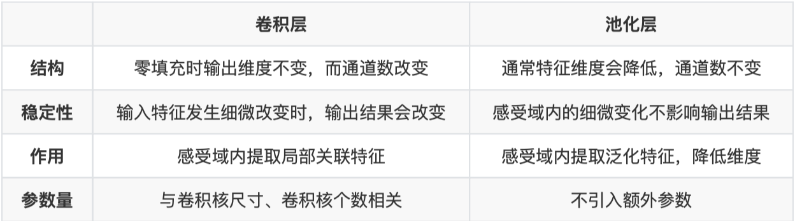

# 卷积神经CNN

## 5.1 卷积神经⽹络的组成层

5.1.1 输⼊层  height  wight  channel

5.1.2 卷积层  作对输⼊层输⼊数据进⾏特征提取

5.1.3 激活层 对卷积层抽取的特征进⾏激活

5.1.4 池化层  特征筛选

5.1.5 全连接层  特征汇总映射

卷积⽹络会将输⼊层的数据传递到⼀系列**卷积、 池化**等操作进⾏**特征提取和转化**，最终由**全连接层对特征进⾏汇总和结果输出**。

## 5.2 卷积在图像中有什么直观作⽤

## 5.3 卷积层有哪些基本参数？

kernel-size padding stride in-channels out-channels

## 5.4 卷积核有什么类型？

1. 标准卷积
2. 扩张卷积 在实时图像分割领域⼴泛应⽤
3. 转置卷积 ⽬标检测领域中对⼩⽬标的检测和图像分割领域还原输⼊图像尺度。
4. 可分离卷积 模型压缩或⼀些轻量的卷积神经⽹络

## 5.5 ⼆维卷积与三维卷积有什么区别？

## 5.7 有哪些池化⽅法？

一般池化 general pooling

重叠池化 overlapping pool

空间金字塔池化 spatial pyramaid pooling

## 5.8 1*1卷积作⽤？

NIN  NIN对不同通道的特征整合到MLP⾃⽹络中，让不同通道的特征能够交互整合，使通道之间的信 息得以流通

GoogLeNet 采⽤ 卷积核来减少模型的参数量

## 5.9 卷积层和池化层有什么区别？

## 5.10 卷积核是否⼀定越⼤越好？

在⼤多数情况下通 过堆叠较⼩的卷积核⽐直接采⽤单个更⼤的卷积核会更加有效。

在某些领域应⽤卷积神经⽹络时仍然可以采⽤较⼤的 卷积核。譬如在⾃然语⾔处理领域，由于⽂本内容不像图像数据可以对特征进⾏很深层的抽象，往往在 该领域的特征提取只需要较浅层的神经⽹络即可。在将卷积神经⽹络应⽤在⾃然语⾔处理领域时，通常 都是较为浅层的卷积层组成，但是⽂本特征有时⼜需要有较⼴的感受域让模型能够组合更多的特征（如 词组和字符），此时直接采⽤较⼤的卷积核将是更好的选择。

## 5.11 每层卷积是否只能⽤⼀种尺⼨的卷积核？

不同尺寸的卷积核,再将分别得到的特征进行整合,得到的新特征可以看作不同感受域提取的特征组合,相比于单一卷积核会有更强的表达能力

## 5.12 怎样才能减少卷积层参数量？

使⽤堆叠⼩卷积核代替⼤卷积核

使⽤分离卷积操作

添加 的卷积操作

在卷积层前使⽤池化操作

## 5.13 在进⾏卷积操作时，必须同时考虑通道和区域吗？

更为灵活的⽅式是使区 域和通道的卷积分离开来，通道分离（深度分离）卷积⽹络由此诞⽣。

我们⾸先对每⼀个通道进⾏各⾃的卷积操作，有多少个通道就有多少个过滤器。得到新的通道特征矩 阵之后，再对这批新通道特征进⾏标准的 跨通道卷积操作。

## 5.14 采⽤宽卷积的好处有什么？

宽卷积对应的是窄卷积，实际上并不是卷积操作的类型，指的是卷积过程中的填充⽅法，对应的 是'SAME'填充和'VALID'填充。

## 5.15 理解转置卷积与棋盘效应

5.15.1 标准卷积

5.15.2 转置卷积

5.15.3 棋盘效应

## 5.16 卷积神经⽹络的参数设置

learning-rate 0-1

batch-size  1-N

epoch 1-N

weight-decay 0-0.001

## 5.17 提⾼卷积神经⽹络的泛化能⼒

1. 使用更多数据
2. 使用更大批次
3. 调整数据
4. 使用更大批次
5. 调整数据分布
6. 调整目标函数
7. 调整网络结构
8. 数据增强
9. 权重正则化
10. 屏蔽网络节点

## 5.18 卷积神经⽹络在不同领域的应⽤

图像处理

自然语言处理

语音处理5.18.1 联系

⾃然语⾔处理是对⼀维信号（词序列）做操作。 计算机视觉是对⼆维（图像）或三维（视频流）信号做操作。

5.18.2 区别

⾃然语⾔处理的输⼊数据通常是离散取值（例如表示⼀个单词或字⺟通常表示为词典中的one hot向 量），计算机视觉则是连续取值（⽐如归⼀化到0，1之间的灰度值）。CNN有两个主要特点，区域不变 性(location invariance)和组合性(Compositionality)。

1. 区域不变性
2. 局部组合性

## 5.19 卷积神经⽹络凸显共性的⽅法？

5.19.1 局部连接

5.19.2 权值共享

5.19.3 池化操作

## 5.20 全连接、局部连接、全卷积与局部卷积

## 5.21 局部卷积的应⽤

## 5.22 NetVLAD池化 （贡献者：熊楚原-中国⼈⺠⼤学）