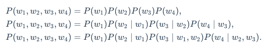
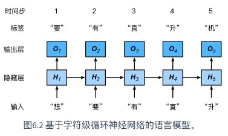

## 循环神经网络

语言模型（language model）是自然语言处理的重要技术。自然语言处理中最常见的数据是文本数据。我们可以把一段**自然语言文本看作一段离散的时间序列**。


#### 语言模型的计算


#### n元语法

当序列长度增加时，计算和存储多个词共同出现的概率的复杂度会呈指数级增加。nn*n*元语法通过马尔可夫假设（虽然并不一定成立）简化了语言模型的计算。

**指一个词的出现只与前面n个词相关，即n 阶马尔可夫链**（Markov chain of order n）


以上也叫n元语法（n-grams）。它是基于n−1阶马尔可夫链的概率语言模型。当n分别为1、2和3时，我们将其分别称作一元语法（unigram）、二元语法（bigram）和三元语法（trigram）。

当n较小时，n元语法往往并不准确。例如，在一元语法中，由三个词组成的句子“你走先”和“你先走”的概率是一样的。然而，当n较大时，n元语法需要计算并存储大量的词频和多词相邻频率。



- **语言模型**是自然语言处理的重要技术。

- N元语法是基于n−1阶马尔可夫链的概率语言模型，其中n权衡了计算复杂度和模型准确性。

#### 循环神经网络

n元语法中，时间步t的词Wt基于所有词的条件概率只考虑最近时间步的n-1词对Wt的可能影响我们需要增大n。但这样模型参数的数量将随之呈指数级增长。

本节将介绍循环神经网络**。它并非刚性地记忆所有固定长度的序列，而是通过隐藏状态来存储之前时间步的信息。**首先我们回忆一下前面介绍过的多层感知机，然后描述如何添加隐藏状态来将它变成循环神经网络。


```python
import torch

X, W_xh = torch.randn(3, 1), torch.randn(1, 4)
H, W_hh = torch.randn(3, 4), torch.randn(4, 4)
torch.matmul(torch.cat((X, H), dim=1), torch.cat((W_xh, W_hh), dim=0))
```

- Character-level recurrent neural network 字符级RNN



- 使用循环计算的网络即循环神经网络。
- 循环神经网络的隐藏状态可以捕捉截至当前时间步的序列的历史信息。
- 循环神经网络模型参数的数量不随时间步的增加而增长。
- 可以基于字符级循环神经网络来创建语言模型。

### RNN简洁实现

- 模型

```python
def rnn(inputs, state, params):
    # inputs和outputs皆为num_steps个形状为(batch_size, vocab_size)的矩阵
    W_xh, W_hh, b_h, W_hq, b_q = params
    H, = state
    outputs = []
    for X in inputs:
        H = torch.tanh(torch.matmul(X, W_xh) + torch.matmul(H, W_hh) + b_h)
        Y = torch.matmul(H, W_hq) + b_q
        outputs.append(Y)
    return outputs, (H,)

```

- 激活函数 tanh
- 损失函数
  - 交叉熵
- 评价
  - 困惑度 perplexity  困惑度是对交叉熵损失函数做指数运算后得到的值
- 优化方法
  - 带梯度裁剪的梯度下降

#### 小结

- 可以用基于字符级循环神经网络的语言模型来生成文本序列，例如创作歌词。
- 当训练循环神经网络时，为了应对梯度爆炸，可以裁剪梯度。
- 困惑度是对交叉熵损失函数做指数运算后得到的值。


