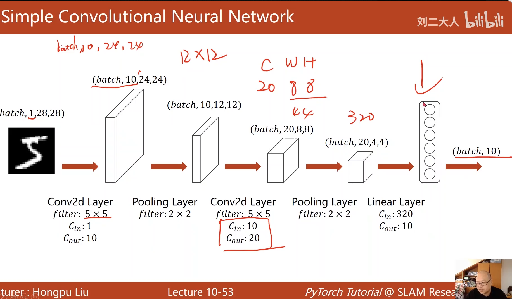

# 深度学习实践 Hongpu liu

## 第一章 概述

### 机器学习概念

人工智能 使用算法进行prediction

#### machine learning主流的监督学习 有标注的数据进行训练 

- 常见算法
  - 穷举
  - 贪心
  - 分治
  - 动态规划

* 机器学习算法  计算过程来自于数据
  * DataSet + model + train


#### 人工智能发展历史

1. rule-based system
2. classic machine learning
3. deep learning


##### 维度诅咒 

feature 的数量越多需要越多的样本


#### 传统机器学习策略


#### 传统学习方法的问题


#### 神经网络的历史  数学+工程系


## 第二章 线性模型


## 第三章梯度下降


- 随机梯度下降   根据每一个样本进行梯度下降   梯度下降能利用并行计算的优点 而随机梯度性能好  minibatch小批量随机梯度下降  使用小批量进行梯度下降  

## 第四章 反向传播 

## 第五章 用pytorch实现线性回归


```python

```


## 第六章逻辑回归

logistic函数 输出0-1的概率


KL 散度   

cross-entropy 交叉熵  两个分布之间差距大小


## 第七章  处理多维输入的特征


## 第八章 加载数据集

random minibatch  random 鞍点  mini训练时间   batch 计算速度快

`epoch`:one forward pass and one backward pass of all training example

`batch-size`: the number of training example in one forward backw pass

`iteration`: number of passes，each pass using [batch size] number of example

`shuffle`打乱


`Dataset` is an abstract class. We can define our class inherited from this class

`Dataloader`is a class to help us loading data in pytorch


## 多分类问题

### `softamax` layer


- 均值和标准差    转换为 0-1分布的标准差 

- 数据归一化 标准化


## 第十二章 CNN





