# deep-learning with pytorch

## torch基础

### 数据操作

- 创建

```python
import torch
x = torch.empty(5, 3)
print(x)
x = torch.rand(5, 3)
print(x)
x = torch.zeros(5, 3, dtype=torch.long)
print(x)
x = torch.tensor([5.5, 3])
print(x)
x = x.new_ones(5, 3, dtype=torch.float64)  # 返回的tensor默认具有相同的torch.dtype和
print(x)

x = torch.randn_like(x, dtype=torch.float) # 指定新的数据类型
print(x)
x.size()
x.shape()
x.shape
history -n
history
```

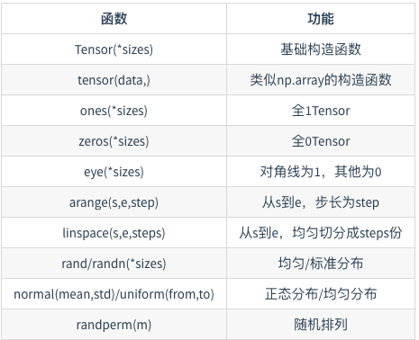


- 运算

```python
y = torch.rand(5,3)
x+y
torch.add(x,y)
y.add_(x)
```

- 索引  **引用共享内存空间**

```python
y = x[0, :]
y += 1
```

- 改变形状

```python
y = x.view(15)
z = x.view(-1, 5)  # -1所指的维度可以根据其他维度的值推出来
```

 **-1 代表自适应 也是共享内存的**

```python
x_cp = x.clone().view(15)
```

- 线性代数运算

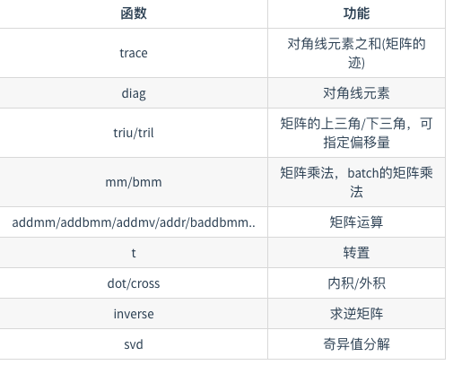

- 广播运算

不同形状的矩阵运算会触发广播 复制成相同形状再运算

- 运算内存开销

  add_() 或 torch.add(x, y, out=y) 可以减低开销 **id()**可用来查看内存地址

- numpy转换 `torch.from_numpy(a)` 会进行数据拷贝

- tensor on GPU

```python
# 以下代码只有在PyTorch GPU版本上才会执行
if torch.cuda.is_available():
    device = torch.device("cuda")          # GPU
    y = torch.ones_like(x, device=device)  # 直接创建一个在GPU上的Tensor
    x = x.to(device)                       # 等价于 .to("cuda")
    z = x + y
    print(z)
    print(z.to("cpu", torch.double))       # to()还可以同时更改数据类型
```


## 深度学习基础

### 线性回归

#### 原理

##### 模型定义

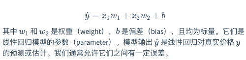

##### 模型训练

1. 训练数据 training set =  sample set = label+feature

   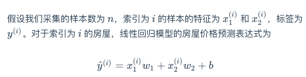

2. loss function

   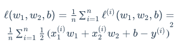目标是我们希望找出一组模型参数，来使训练样本平均损失最小

3. gradient descent

   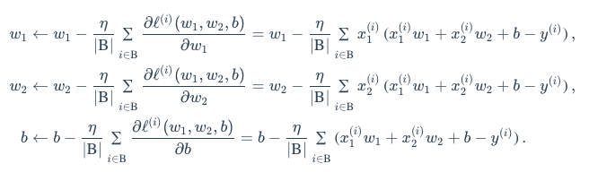先选取一组模型参数的初始值，如随机选取；接下来对参数进行多次迭代，使每次迭代都可能降低损失函数的值。在每次迭代中，先随机均匀采样一个由固定数目训练数据样本所组成的小批量（mini-batch）B，然后求小批量中数据样本的平均损失有关模型参数的导数（梯度）。


##### 模型预测

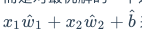来预测模型

#### 实现

```python

# IPython log file
get_ipython().run_line_magic('matplotlib', '')
import torch
from IPython import display
from matplotlib import pyplot as plt
import numpy as np
import random
num_inputs = 2 
num_examples = 1000
true_w = [2, -3.4]
true_b = 4.2
features = torch.randn(num_examples, num_inputs,
                       dtype=torch.float32)
labels = true_w[0] * features[:, 0] + true_w[1] * features[:, 1] + true_b
labels += torch.tensor(np.random.normal(0, 0.01, size=labels.size()),
                       dtype=torch.float32)
def use_svg_display():
    # 用矢量图显示
    display.set_matplotlib_formats('svg')

def set_figsize(figsize=(3.5, 2.5)):
    use_svg_display()
    # 设置图的尺寸
    plt.rcParams['figure.figsize'] = figsize

set_figsize()
plt.scatter(features[:, 1].numpy(), labels.numpy(), 1);

def data_iter(batch_size, features, labels):
    num_examples = len(features)
    indices = list(range(num_examples))
    random.shuffle(indices)  # 样本的读取顺序是随机的
    for i in range(0, num_examples, batch_size):
        j = torch.LongTensor(indices[i: min(i + batch_size, num_examples)]) # 最后一次可能不足一个batch
        yield  features.index_select(0, j), labels.index_select(0, j)

w = torch.tensor(np.random.normal(0, 0.01, (num_inputs, 1)), dtype=torch.float32)
b = torch.zeros(1, dtype=torch.float32)
w.requires_grad_(requires_grad=True)
b.requires_grad_(requires_grad=True) 

def linreg(X, w, b):  #
    return torch.mm(X, w) + b

def squared_loss(y_hat, y):
    # 注意这里返回的是向量, 另外, pytorch里的MSELoss并没有除以 2
    return (y_hat - y.view(y_hat.size())) ** 2 / 2

def sgd(params, lr, batch_size):  # 本函数已保存在d2lzh_pytorch包中方便以后使用
    for param in params:
        param.data -= lr * param.grad / batch_size # 注意这里更改param时用的param.data

lr = 0.03
num_epochs = 3
net = linreg
loss = squared_loss

for epoch in range(num_epochs):  # 训练模型一共需要num_epochs个迭代周期
    # 在每一个迭代周期中，会使用训练数据集中所有样本一次（假设样本数能够被批量大小整除）。X
    # 和y分别是小批量样本的特征和标签
    for X, y in data_iter(batch_size, features, labels):
        l = loss(net(X, w, b), y).sum()  # l是有关小批量X和y的损失
        l.backward()  # 小批量的损失对模型参数求梯度
        sgd([w, b], lr, batch_size)  # 使用小批量随机梯度下降迭代模型参数
        # 不要忘了梯度清零
        w.grad.data.zero_()
        b.grad.data.zero_()
    train_l = loss(net(features, w, b), labels)
    print('epoch %d, loss %f' % (epoch + 1, train_l.mean().item()))

print(true_w, '\n', w)
print(true_b, '\n', b)

```


```python
# IPython log file

import torch
import torch.nn as nn
import numpy as np
num_inputs = 2
num_examples = 1000
true_w = [2, -3.4]
true_b = 4.2
features = torch.tensor(np.random.normal(0, 1, (num_examples, num_inputs)), dtype=torch.float)
labels = true_w[0] * features[:, 0] + true_w[1] * features[:, 1] + true_b
labels += torch.tensor(np.random.normal(0, 0.01, size=labels.size()), dtype=torch.float)
import torch.utils.data as Data

batch_size = 10
# 将训练数据的特征和标签组合
dataset = Data.TensorDataset(features, labels)
# 随机读取小批量
data_iter = Data.DataLoader(dataset, batch_size, shuffle=True)
class LinearNet(nn.Module):
    def __init__(self, n_feature):
        super(LinearNet, self).__init__()
        self.linear = nn.Linear(n_feature, 1)
    # forward 定义前向传播
    def forward(self, x):
        y = self.linear(x)
        return y

net = LinearNet(num_inputs)
print(net) # 使用print可以打印出网络的结构
from collections import OrderedDict
net = nn.Sequential(OrderedDict([
          ('linear', nn.Linear(num_inputs, 1))
          # ......
        ]))
from torch.nn import init

init.normal_(net[0].weight, mean=0, std=0.01)
init.constant_(net[0].bias, val=0)  # 也可以直接修改bias的data: net[0].bias.data.fill_(0)
loss = nn.MSELoss()
import torch.optim as optim

optimizer = optim.SGD(net.parameters(), lr=0.03)
print(optimizer)
num_epochs = 3
for epoch in range(1, num_epochs + 1):
    for X, y in data_iter:
        output = net(X)
        l = loss(output, y.view(-1, 1))
        optimizer.zero_grad() # 梯度清零，等价于net.zero_grad()
        l.backward()
        optimizer.step()
    print('epoch %d, loss: %f' % (epoch, l.item()))
dense = net[0]
print(true_w, dense.weight)
print(true_b, dense.bias)
get_ipython().run_line_magic('logstop', '')

```


### softmax回归

##### 原理

对于这样的离散值预测问题，我们可以使用诸如softmax回归在内的分类模型。和线性回归不同，softmax回归的输出单元从一个变成了多个

**回归模型**

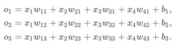

**softmax运算符**

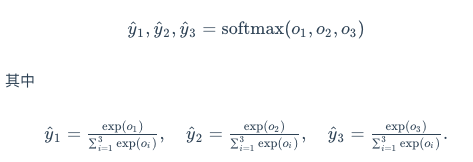

**softmax回归对样本*i*分类的矢量计算表达式为**

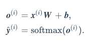

**交叉熵cross entropy**

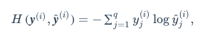

**交叉熵损失函数**

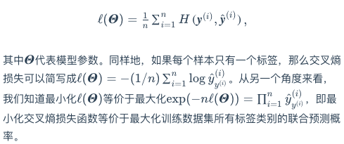

`最小化交叉熵损失函数等价于最大化训练数据集所有标签类别的联合预测概率`

#### 实现

```python
# coding: utf-8
import torch
import torchvision
import numpy as np
import sys
sys.path.append("..") # 为了导入上层目录的d2lzh_pytorch
import d2lzh_pytorch as d2l
batch_size = 256
train_iter, test_iter = d2l.load_data_fashion_mnist(batch_size)
num_inputs = 784
num_outputs = 10

W = torch.tensor(np.random.normal(0, 0.01, (num_inputs, num_outputs)), dtype=torch.float)
b = torch.zeros(num_outputs, dtype=torch.float)
W.requires_grad_(requires_grad=True)
b.requires_grad_(requires_grad=True) 
def softmax(X):
    X_exp = X.exp()
    partition = X_exp.sum(dim=1, keepdim=True)
    return X_exp / partition  # 这里应用了广播机制
def net(X):
    return softmax(torch.mm(X.view((-1, num_inputs)), W) + b)
def cross_entropy(y_hat, y):
    return - torch.log(y_hat.gather(1, y.view(-1, 1)))
def accuracy(y_hat, y):
    return (y_hat.argmax(dim=1) == y).float().mean().item()
# 本函数已保存在d2lzh_pytorch包中方便以后使用。该函数将被逐步改进：它的完整实现将在“图像增广”一节中描述
def evaluate_accuracy(data_iter, net):
    acc_sum, n = 0.0, 0
    for X, y in data_iter:
        acc_sum += (net(X).argmax(dim=1) == y).float().sum().item()
        n += y.shape[0]
    return acc_sum / n
num_epochs, lr = 5, 0.1

# 本函数已保存在d2lzh包中方便以后使用
def train_ch3(net, train_iter, test_iter, loss, num_epochs, batch_size,
              params=None, lr=None, optimizer=None):
    for epoch in range(num_epochs):
        train_l_sum, train_acc_sum, n = 0.0, 0.0, 0
        for X, y in train_iter:
            y_hat = net(X)
            l = loss(y_hat, y).sum()

            # 梯度清零
            if optimizer is not None:
                optimizer.zero_grad()
            elif params is not None and params[0].grad is not None:
                for param in params:
                    param.grad.data.zero_()

            l.backward()
            if optimizer is None:
                d2l.sgd(params, lr, batch_size)
            else:
                optimizer.step()  # “softmax回归的简洁实现”一节将用到


            train_l_sum += l.item()
            train_acc_sum += (y_hat.argmax(dim=1) == y).sum().item()
            n += y.shape[0]
        test_acc = evaluate_accuracy(test_iter, net)
        print('epoch %d, loss %.4f, train acc %.3f, test acc %.3f'
              % (epoch + 1, train_l_sum / n, train_acc_sum / n, test_acc))

train_ch3(net, train_iter, test_iter, cross_entropy, num_epochs, batch_size, [W, b], lr)
%save -r mysession 1-999999

```


```python
# IPython log file

import torch
from torch import nn
from torch.nn import init
import numpy as np
import sys
sys.path.append("..") 
import d2lzh_pytorch as d2l
batch_size = 256
train_iter, test_iter = d2l.load_data_fashion_mnist(batch_size)
num_inputs = 784
num_outputs = 10

class LinearNet(nn.Module):
    def __init__(self, num_inputs, num_outputs):
        super(LinearNet, self).__init__()
        self.linear = nn.Linear(num_inputs, num_outputs)
    def forward(self, x): # x shape: (batch, 1, 28, 28)
        y = self.linear(x.view(x.shape[0], -1))
        return y

net = LinearNet(num_inputs, num_outputs)
# 本函数已保存在d2lzh_pytorch包中方便以后使用
class FlattenLayer(nn.Module):
    def __init__(self):
        super(FlattenLayer, self).__init__()
    def forward(self, x): # x shape: (batch, *, *, ...)
        return x.view(x.shape[0], -1)
from collections import OrderedDict

net = nn.Sequential(
    # FlattenLayer(),
    # nn.Linear(num_inputs, num_outputs)
    OrderedDict([
        ('flatten', FlattenLayer()),
        ('linear', nn.Linear(num_inputs, num_outputs))
    ])
)
init.normal_(net.linear.weight, mean=0, std=0.01)
init.constant_(net.linear.bias, val=0) 
init.normal_(net.linear.weight, mean=0, std=0.01)
init.constant_(net.linear.bias, val=0) 
loss = nn.CrossEntropyLoss()
optimizer = torch.optim.SGD(net.parameters(), lr=0.1)
num_epochs = 5
d2l.train_ch3(net, train_iter, test_iter, loss, num_epochs, batch_size, None, None, optimizer)

```


### MLP 多层感知机

##### 隐藏层

多层感知机在单层神经网络的基础上引入了一到多个隐藏层（hidden layer）。隐藏层位于输入层和输出层之间。

##### 激活函数 `引入非线性变换`

1. ReLU
2. sigmoid
3. tanh

##### 多层感知机

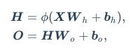

其中ϕ表示激活函数。在分类问题中，我们可以对输出O做softmax运算，并使用softmax回归中的交叉熵损失函数。 在回归问题中，我们将输出层的输出个数设为1，并将输出O\boldsymbol{O}**O**直接提供给线性回归中使用的平方损失函数。


##### 实现

```python
# IPython log file

get_ipython().run_line_magic('logstart', '')
import torch
import numpy as np
import sys
sys.path.append("..")
import d2lzh_pytorch as d2l
batch_size = 256
train_iter, test_iter = d2l.load_data_fashion_mnist(batch_size)
num_inputs, num_outputs, num_hiddens = 784, 10, 256

W1 = torch.tensor(np.random.normal(0, 0.01, (num_inputs, num_hiddens)), dtype=torch.float)
b1 = torch.zeros(num_hiddens, dtype=torch.float)
W2 = torch.tensor(np.random.normal(0, 0.01, (num_hiddens, num_outputs)), dtype=torch.float)
b2 = torch.zeros(num_outputs, dtype=torch.float)

params = [W1, b1, W2, b2]
for param in params:
    param.requires_grad_(requires_grad=True)
def relu(X):
    return torch.max(input=X, other=torch.tensor(0.0))
def net(X):
    X = X.view((-1, num_inputs))
    H = relu(torch.matmul(X, W1) + b1)
    return torch.matmul(H, W2) + b2
loss = torch.nn.CrossEntropyLoss()
num_epochs, lr = 5, 100.0
d2l.train_ch3(net, train_iter, test_iter, loss, num_epochs, batch_size, params, lr)
get_ipython().run_line_magic('logstop', '')

```

```python
batch_size = 256
train_iter, test_iter = d2l.load_data_fashion_mnist(batch_size)
loss = torch.nn.CrossEntropyLoss()

optimizer = torch.optim.SGD(net.parameters(), lr=0.5)

num_epochs = 5
d2l.train_ch3(net, train_iter, test_iter, loss, num_epochs, batch_size, None, None, optimizer)

```


### 深度学习常见问题和优化

##### 欠拟合与过拟合

- 由于无法从训练误差估计泛化误差，一味地降低训练误差并不意味着泛化误差一定会降低。机器学习模型应关注降低泛化误差。
- 可以使用验证数据集来进行模型选择。
- 欠拟合指模型无法得到较低的训练误差，过拟合指模型的训练误差远小于它在测试数据集上的误差。
- 应选择复杂度合适的模型并避免使用过少的训练样本。

##### 过拟合现象的解决方法

- 权重衰减（weight decay）

权重衰减等价于 L2L_2*L*2 范数正则化（regularization）。正则化通过为模型损失函数添加惩罚项使学出的模型参数值较小，是应对过拟合的常用手段。

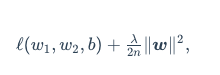

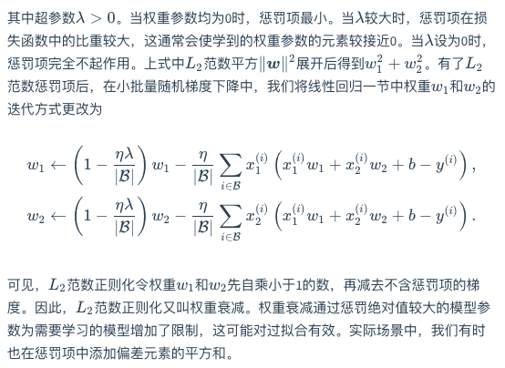

- 丢弃法（dropout）

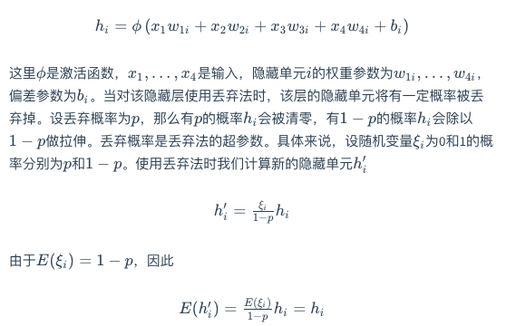

丢弃法不改变其输入的期望值

在测试模型时，我们为了拿到更加确定性的结果，一般不使用丢弃法。

##### 正向传播，反向传播和计算图

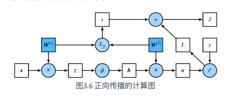

`带惩罚项`

最靠近输入层的模型参数的梯度

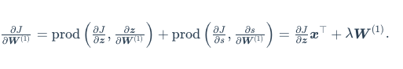

- 正向传播沿着从输入层到输出层的顺序，依次计算并存储神经网络的中间变量。
- 反向传播沿着从输出层到输入层的顺序，依次计算并存储神经网络中间变量和参数的梯度。
- 在训练深度学习模型时，正向传播和反向传播相互依赖。

##### 数值稳定性

衰减（vanishing）和爆炸（explosion）

随机初始化模型参数

- 深度模型有关数值稳定性的典型问题是衰减和爆炸。当神经网络的层数较多时，模型的数值稳定性容易变差。
- 我们通常需要随机初始化神经网络的模型参数，如权重参数。


## 深度学习计算

##### 构造模型

- 可以通过继承`Module`类来构造模型。
- `Sequential`、`ModuleList`、`ModuleDict`类都继承自`Module`类。
- 与`Sequential`不同，`ModuleList`和`ModuleDict`并没有定义一个完整的网络，它们只是将不同的模块存放在一起，需要自己定义`forward`函数。
- 虽然`Sequential`等类可以使模型构造更加简单，但直接继承`Module`类可以极大地拓展模型构造的灵活性。

##### 模型参数访问，初始化，共享

```python
for name, param in net.named_parameters():
    print(name, param.size()
          
for name, param in net.named_parameters():
    if 'weight' in name:
        init.normal_(param, mean=0, std=0.01)
        print(name, param.data)          
```

如果我们传入`Sequential`的模块是同一个`Module`实例的话参数也是共享的,因为模型参数里包含了梯度，所以在反向传播计算时，这些共享的参数的梯度是累加的:

##### 自定义层

- 类通过继承`Module`类
- Parameter类

##### 模型存储和计算

- torch.save(x, 'x.pt')
- torch.load('xy.pt')
- net.state_dict()
- 仅保存和加载模型参数(`state_dict`)；
- 保存和加载整个模型。

##### GPU计算

- PyTorch可以指定用来存储和计算的设备，如使用内存的CPU或者使用显存的GPU。在默认情况下，PyTorch会将数据创建在内存，然后利用CPU来计算。
- PyTorch要求计算的所有输入数据都在内存或同一块显卡的显存上
