# 优化算法

## 优化与深度学习

在一个深度学习问题中，我们通常会预先定义一个损失函数。有了损失函数以后，我们就可以使用优化算法试图将其最小化。在优化中，这样的损失函数通常被称作优化问题的目标函数（objective function）。依据惯例，优化算法通常只考虑最小化目标函数。其实，任何最大化问题都可以很容易地转化为最小化问题，只需令目标函数的相反数为新的目标函数即可。

### 优化与深度学习的关系

虽然优化为深度学习提供了最小化损失函数的方法，但本质上，优化与深度学习的目标是有区别的。

我们区分了训练误差和泛化误差。 由于优化算法的目标函数通常是一个基于训练数据集的损失函数，优化的目标在于**降低训练误差**。 而深度学习的目标在于**降低泛化误差**。为了降低泛化误差，除了使用优化算法降低训练误差以外，还需要注意应对过拟合。

### 优化在深度学习中的挑战

深度学习中绝大多数目标函数都很复杂。因此，很多优化问题并不存在解析解，而需要使用基于数值方法的优化算法找到近似解，即数值解。本书中讨论的优化算法都是这类基于数值方法的算法。为了求得最小化目标函数的数值解，我们将通过优化算法有限次迭代模型参数来尽可能降低损失函数的值。

### 局部最小值

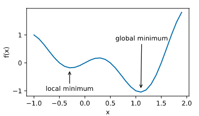

### 鞍点

梯度接近或变成零可能是由于当前解在局部最优解附近造成的。事实上，另一种可能性是当前解在鞍点（saddle point）附近。

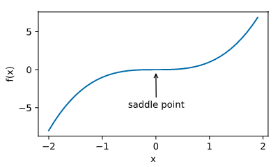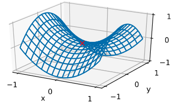

假设一个函数的输入为**k**维向量，输出为标量，那么它的海森矩阵（Hessian matrix）有**k**个特征值。该函数在梯度为0的位置上可能是局部最小值、局部最大值或者鞍点。

- 当函数的海森矩阵在梯度为零的位置上的特征值全为正时，该函数得到局部最小值。
- 当函数的海森矩阵在梯度为零的位置上的特征值全为负时，该函数得到局部最大值。
- 当函数的海森矩阵在梯度为零的位置上的特征值有正有负时，该函数得到鞍点。

随机矩阵理论告诉我们，对于一个大的高斯随机矩阵来说，任一特征值是正或者是负的概率都是0.5 [1]。那么，以上第一种情况的概率为 0.5^k。由于深度学习模型参数通常都是高维的（**k**很大），目标函数的鞍点通常比局部最小值更常见。

### 小结

- 由于优化算法的目标函数通常是一个基于训练数据集的损失函数，优化的目标在于降低训练误差。
- 由于深度学习模型参数通常都是高维的，目标函数的鞍点通常比局部最小值更常见

## 梯度下降和随机梯度下降

### 一维梯度下降

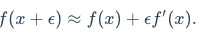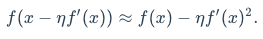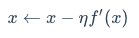

```python
%matplotlib inline
import numpy as np
import torch
import math
import sys
sys.path.append("..") 
import dl as d2l
def gd(eta):
    x = 10
    results = [x]
    for i in range(10):
        x -= eta * 2 * x  # f(x) = x * x的导数为f'(x) = 2 * x
        results.append(x)
    print('epoch 10, x:', x)
    return results

res = gd(0.2)

def show_trace(res):
    n = max(abs(min(res)), abs(max(res)), 10)
    f_line = np.arange(-n, n, 0.1)
    d2l.set_figsize()
    d2l.plt.plot(f_line, [x * x for x in f_line])
    d2l.plt.plot(res, [x * x for x in res], '-o')
    d2l.plt.xlabel('x')
    d2l.plt.ylabel('f(x)')

show_trace(res)

```

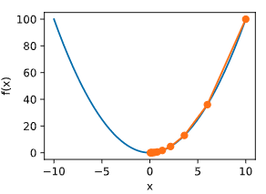

### 学习率

- 学习率过小

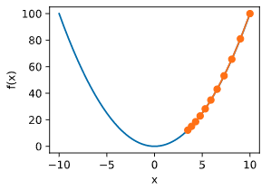

- 学习率过大 overshoot

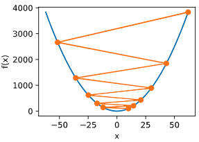

### 多维梯度下降

梯度方向 

```python
def train_2d(trainer):  # 本函数将保存在dl包中方便以后使用
    x1, x2, s1, s2 = -5, -2, 0, 0  # s1和s2是自变量状态，本章后续几节会使用
    results = [(x1, x2)]
    for i in range(20):
        x1, x2, s1, s2 = trainer(x1, x2, s1, s2)
        results.append((x1, x2))
    print('epoch %d, x1 %f, x2 %f' % (i + 1, x1, x2))
    return results

def show_trace_2d(f, results):  # 本函数将保存在dl包中方便以后使用
    d2l.plt.plot(*zip(*results), '-o', color='#ff7f0e')
    x1, x2 = np.meshgrid(np.arange(-5.5, 1.0, 0.1), np.arange(-3.0, 1.0, 0.1))
    d2l.plt.contour(x1, x2, f(x1, x2), colors='#1f77b4')
    d2l.plt.xlabel('x1')
    d2l.plt.ylabel('x2')
```


```python
eta = 0.1

def f_2d(x1, x2):  # 目标函数
    return x1 ** 2 + 2 * x2 ** 2

def gd_2d(x1, x2, s1, s2):
    return (x1 - eta * 2 * x1, x2 - eta * 4 * x2, 0, 0)

show_trace_2d(f_2d, train_2d(gd_2d))
```

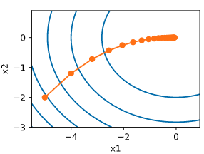

### 随机梯度下降

如果使用梯度下降，每次自变量迭代的计算开销为$\mathcal{O}(n)$，它随着n线性增长。因此，当训练数据样本数很大时，梯度下降每次迭代的计算开销很高。

随机梯度下降（stochastic gradient descent，SGD）减少了每次迭代的计算开销。在随机梯度下降的每次迭代中，我们随机均匀采样的一个样本索引计算这一个样本梯度来迭代x


### 小结

- 使用适当的学习率，沿着梯度反方向更新自变量可能降低目标函数值。梯度下降重复这一更新过程直到得到满足要求的解。
- 学习率过大或过小都有问题。一个合适的学习率通常是需要通过多次实验找到的。
- 当训练数据集的样本较多时，梯度下降每次迭代的计算开销较大，因而随机梯度下降通常更受青睐。

## 小批量随机梯度下降

在每一次迭代中，**梯度下降**使用整个训练数据集来计算梯度，因此它有时也被称为**批量梯度下降**（batch gradient descent）。而**随机梯度下降**在每次迭代中只随机采样一个样本来计算梯度。正如我们在前几章中所看到的，我们还可以在每轮迭代中随机均匀采样多个样本来组成一个小批量，然后使用这个小批量来计算梯度。下面就来描述小批量随机梯度下降。

当批量较小时，每次迭代中使用的样本少，这会导致并行处理和内存使用效率变低。这使得在计算同样数目样本的情况下比使用更大批量时所花时间更多。当批量较大时，每个小批量梯度里可能含有更多的冗余信息。为了得到较好的解，批量较大时比批量较小时需要计算的样本数目可能更多，例如增大迭代周期数。

#### 小结

- 小批量随机梯度每次随机均匀采样一个小批量的训练样本来计算梯度。
- 在实际中，（小批量）随机梯度下降的学习率可以在迭代过程中自我衰减。
- 通常，小批量随机梯度在每个迭代周期的耗时介于梯度下降和随机梯度下降的耗时之间。

## 传统梯度下降的不足

目标函数有关自变量的梯度代表了目标函数在自变量当前位置下降最快的方向。因此，**梯度下降也叫作最陡下降**（steepest descent）。在每次迭代中，梯度下降根据自变量当前位置，沿着当前位置的梯度更新自变量。然而，如果**自变量的迭代方向仅仅取决于自变量当前位置，这可能会带来一些问题。**

### 梯度下降的问题

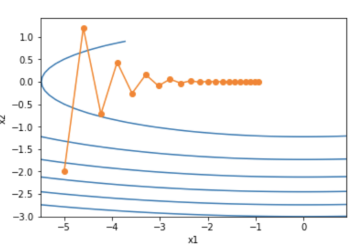

同一位置上，目标函数在竖直方向（x_2轴方向）比在水平方向（x_1轴方向）的斜率的绝对值更大。因此，给定学习率，梯度下降迭代自变量时会使自变量在竖直方向比在水平方向移动幅度更大。那么，我们需要一个较小的学习率从而避免自变量在竖直方向上越过目标函数最优解。然而，这会造成自变量在水平方向上朝最优解移动变慢。

下面我们试着将学习率调得稍大一点，此时自变量在竖直方向不断越过最优解并逐渐发散。

## 动量法

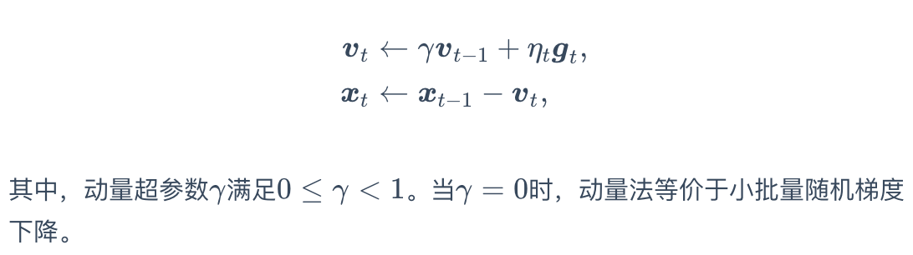

### 指数加权移动平均

### 指数加权移动平均理解动量法

- 动量法使用了指数加权移动平均的思想。它将过去时间步的梯度做了加权平均，且权重按时间步指数衰减。
- 动量法使得相邻时间步的自变量更新在方向上更加一致。


## AdaGrad算法

**AdaGrad算法，它根据自变量在每个维度的梯度值的大小来调整各个维度上的学习率，从而避免统一的学习率难以适应所有维度的问题**

- AdaGrad算法在迭代过程中不断调整学习率，并让目标函数自变量中每个元素都分别拥有自己的学习率。
- 使用AdaGrad算法时，自变量中每个元素的学习率在迭代过程中一直在降低（或不变）。

## RMSProp

因此，当学习率在迭代早期降得较快且当前解依然不佳时，AdaGrad算法在迭代后期由于学习率过小，可能较难找到一个有用的解。

## AdaDelta

**AdaGrad算法，它根据自变量在每个维度的梯度值的大小来调整各个维度上的学习率，从而避免统一的学习率难以适应所有维度的问题**


## Adam算法

所以Adam算法可以看做是RMSProp算法与动量法的结合。


# 计算性能

## 命令式和符号式混合编程

命令式编程

```python
def add(a, b):
    return a + b

def fancy_func(a, b, c, d):
    e = add(a, b)
    f = add(c, d)
    g = add(e, f)
    return g

fancy_func(1, 2, 3, 4) # 10
```

符号式编程

1. 定义计算流程；
2. 把计算流程编译成可执行的程序；
3. 给定输入，调用编译好的程序执行。

```python
def add_str():
    return '''
def add(a, b):
    return a + b
'''

def fancy_func_str():
    return '''
def fancy_func(a, b, c, d):
    e = add(a, b)
    f = add(c, d)
    g = add(e, f)
    return g
'''

def evoke_str():
    return add_str() + fancy_func_str() + '''
print(fancy_func(1, 2, 3, 4))
'''

prog = evoke_str()
print(prog)
y = compile(prog, '', 'exec')
exec(y)
```

- 命令式编程更方便。当我们在Python里使用命令式编程时，大部分代码编写起来都很直观。同时，命令式编程更容易调试。这是因为我们可以很方便地获取并打印所有的中间变量值，或者使用Python的调试工具。
- 符号式编程更高效并更容易移植。一方面，在编译的时候系统容易做更多优化；另一方面，符号式编程可以将程序变成一个与Python无关的格式，从而可以使程序在非Python环境下运行，以避开Python解释器的性能问题。

大部分深度学习框架在命令式编程和符号式编程之间二选一。例如，**Theano和受其启发的后来者TensorFlow使用了符号式编程，Chainer和它的追随者PyTorch使用了命令式编程，而Gluon则采用了混合式编程的方式**。


## 异步计算

默认情况下，PyTorch中的 GPU 操作是异步的。当调用一个使用 GPU 的函数时，这些操作会在特定的设备上排队但不一定会在稍后立即执行。这就使我们可以并行更多的计算，包括 CPU 或其他 GPU 上的操作。 一般情况下，异步计算的效果对调用者是不可见的，因为（1）每个设备按照它们排队的顺序执行操作，（2）在 CPU 和 GPU 之间或两个 GPU 之间复制数据时，PyTorch会自动执行必要的同步操作。因此，计算将按每个操作同步执行的方式进行。 可以通过设置环境变量`CUDA_LAUNCH_BLOCKING = 1`来强制进行同步计算。当 GPU 产生error时，这可能非常有用。（异步执行时，只有在实际执行操作之后才会报告此类错误，因此堆栈跟踪不会显示请求的位置。）

## 自动并行计算

默认情况下，GPU 操作是异步的。当调用一个使用 GPU 的函数时，这些操作会在特定的设备上排队，但不一定会在稍后执行。这允许我们并行更多的计算，包括 CPU 或其他 GPU 上的操作。 下面看一个简单的例子。

首先导入本节中实验所需的包或模块。注意，需要至少2块GPU才能运行本节实验。

可以看到，当两个计算任务一起执行时，执行总时间小于它们分开执行的总和。这表明，PyTorch能有效地实现在不同设备上自动并行计算。

## 多GPU计算

要想使用PyTorch进行多GPU计算，最简单的方法是直接用`torch.nn.DataParallel`将模型wrap一下即可：

这时，默认所有存在的GPU都会被使用。

但我们只想使用0、3号显卡，那么我们可以用参数`device_ids`指定即可:`torch.nn.DataParallel(net, device_ids=[0, 3])`。

多GPU模型的保存于加载

事实上`DataParallel`也是一个`nn.Module`，只是这个类其中有一个module就是传入的实际模型。因此当我们调用`DataParallel`后，模型结构变了（在外面加了一层而已，从8.4.1节两个输出可以对比看出来）。所以直接加载肯定会报错的，因为模型结构对不上。

所以正确的方法是保存的时候只保存`net.module`:

```python
torch.save(net.module.state_dict(), "./8.4_model.pt")
new_net.load_state_dict(torch.load("./8.4_model.pt")) # 加载成功
```


