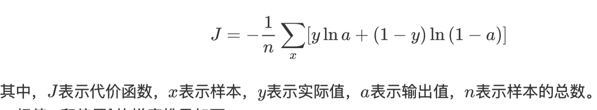
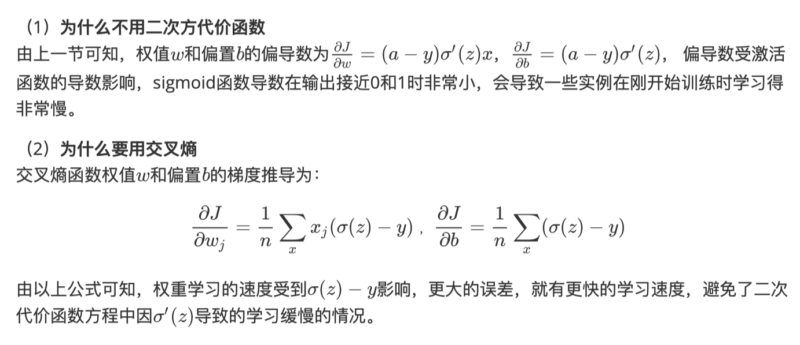

# 第九周学习笔记

## alexnet

```
import torch
from torch import nn

__all__ = ('AlexNet',)

from dl import load_data_fashion_mnist
from dl.train import train_fashion_mnist_gpu


class AlexNet(nn.Module):
    def __init__(self):
        super(AlexNet, self).__init__()
        self.conv = nn.Sequential(
            nn.Conv2d(1, 96, 11, 4),  # in_channels, out_channels, kernel_size, stride, padding
            nn.ReLU(),
            nn.MaxPool2d(3, 2),  # kernel_size, stride
            # 减小卷积窗口，使用填充为2来使得输入与输出的高和宽一致，且增大输出通道数
            nn.Conv2d(96, 256, 5, 1, 2),
            nn.ReLU(),
            nn.MaxPool2d(3, 2),
            # 连续3个卷积层，且使用更小的卷积窗口。除了最后的卷积层外，进一步增大了输出通道数。
            # 前两个卷积层后不使用池化层来减小输入的高和宽
            nn.Conv2d(256, 384, 3, 1, 1),
            nn.ReLU(),
            nn.Conv2d(384, 384, 3, 1, 1),
            nn.ReLU(),
            nn.Conv2d(384, 256, 3, 1, 1),
            nn.ReLU(),
            nn.MaxPool2d(3, 2)
        )
        # 这里全连接层的输出个数比LeNet中的大数倍。使用丢弃层来缓解过拟合
        self.fc = nn.Sequential(
            nn.Linear(256 * 5 * 5, 4096),
            nn.ReLU(),
            nn.Dropout(0.5),
            nn.Linear(4096, 4096),
            nn.ReLU(),
            nn.Dropout(0.5),
            # 输出层。由于使用Fashion-MNIST，所以用类别数为10，而非论文中的1000
            nn.Linear(4096, 10),
        )

    def forward(self, img):
        feature = self.conv(img)
        output = self.fc(feature.view(img.shape[0], -1))
        return output


```

## 代价函数

### 为什么需要代价函数

1. 为了得到训练逻辑回归模型的参数，需要⼀个代价函数，通过训练代价函数来得到参数。

2. ⽤于找到最优解的⽬的函数。

### 常见代价函数

* 二次代价函数


* 交叉熵代价函数（cross-entropy)



* 对数似然代价函数

### 为什么⽤交叉熵代替⼆次代价函数



## 损失函数

### 常见损失函数

* 0-1损失函数
* 绝对值损失函数
* 平方损失函数
* 对数损失函数
* 指数损失函数

* Hinge损失函数 