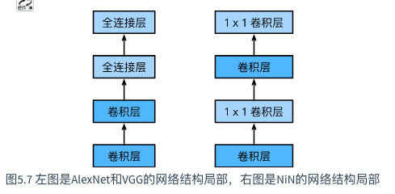

## 卷积神经网络

### 二维卷积层

卷积神经网络（convolutional neural network）是含有卷积层（convolutional layer）的神经网络。本章中介绍的卷积神经网络均使用最常见的二维卷积层。它有高和宽两个空间维度，常用来处理图像数据。本节中，我们将介绍简单形式的二维卷积层的工作原理。

#### 互相关运算

虽然卷积层得名于卷积（convolution）运算，但我们通常在卷积层中使用更加直观的互相关（cross-correlation）运算


kernel=filter

```python
import torch
from torch import nn

def corr2d(X, K):  # 本函数已保存在d2lzh_pytorch包中方便以后使用
    h, w = K.shape
    Y = torch.zeros((X.shape[0] - h + 1, X.shape[1] - w + 1))
    for i in range(Y.shape[0]):
        for j in range(Y.shape[1]):
            Y[i, j] = (X[i: i + h, j: j + w] * K).sum()
    return Y
```

```python
class Conv2D(nn.Module):
    def __init__(self, kernel_size):
        super(Conv2D, self).__init__()
        self.weight = nn.Parameter(torch.randn(kernel_size))
        self.bias = nn.Parameter(torch.randn(1))

    def forward(self, x):
        return corr2d(x, self.weight) + self.bias
```

#### 卷积层的简单应用：检测图像中物体的边缘

#### 互相关运算和卷积运算

那么，你也许会好奇卷积层为何能使用互相关运算替代卷积运算。其实**，在深度学习中核数组都是学出来的：卷积层无论使用互相关运算或卷积运算**都不影响模型预测时的输出。

#### 特征图（feature map ）和感受野（receptive field）

二维卷积层输出的二维数组可以看作是输入在空间维度（宽和高）上某一级的表征，也叫特征图（feature map）。影响元素xx*x*的前向计算的所有可能输入区域（可能大于输入的实际尺寸）叫做xx*x*的感受野（receptive field）。我们可以通过更深的卷积神经网络使特征图中单个元素的感受野变得更加广阔，从而捕捉输入上更大尺寸的特征。


- 二维卷积层的核心计算是二维互相关运算。在最简单的形式下，它对二维输入数据和卷积核做互相关运算然后加上偏差。
- 我们可以设计卷积核来检测图像中的边缘。
- 我们可以通过数据来学习卷积核。

#### 填充和步幅 padding stride

卷积层的输出形状由输入形状和卷积核窗口形状决定。本节我们将介绍卷积层的两个超参数，即填充和步幅。

- 填充可以增加输出的高和宽。这常用来使输出与输入具有相同的高和宽。
- 步幅可以减小输出的高和宽，例如输出的高和宽仅为输入的高和宽的1/n1/n1/*n*（nn*n*为大于1的整数）。

### 多通道

我们将大小为3的这一维称为通道（channel）维。本节我们将介绍含多个输入通道或多个输出通道的卷积核。

#### 多输入通道

当输入数据含多个通道时，我们需要构造一个输入通道数与输入数据的通道数相同的卷积核 


#### 多输出通道

当输入通道有多个时，因为我们对各个通道的结果做了累加，所以不论输入通道数是多少，输出通道数总是为1。如果希望多输出为每个通道创建核数组。

#### 1*1卷积层

- 使用多通道可以拓展卷积层的模型参数。
- 假设将通道维当作特征维，将高和宽维度上的元素当成数据样本，那么1×1卷积层的作用与全连接层等价。
- 1×1卷积层通常用来调整网络层之间的通道数，并控制模型复杂度。

#### 通过数据学习核数组

```python
# 构造一个核数组形状是(1, 2)的二维卷积层
conv2d = Conv2D(kernel_size=(1, 2))

step = 20
lr = 0.01
for i in range(step):
    Y_hat = conv2d(X)
    l = ((Y_hat - Y) ** 2).sum()
    l.backward()

    # 梯度下降
    conv2d.weight.data -= lr * conv2d.weight.grad
    conv2d.bias.data -= lr * conv2d.bias.grad

    # 梯度清0
    conv2d.weight.grad.fill_(0)
    conv2d.bias.grad.fill_(0)
    if (i + 1) % 5 == 0:
        print('Step %d, loss %.3f' % (i + 1, l.item()))
```

### 池化层

**pooling**它的提出是**为了缓解卷积层对位置的过度敏感性**。

##### 二维最大池化层和平均池化层

同卷积层一样，池化层每次对输入数据的一个固定形状窗口（又称池化窗口）中的元素计算输出。不同于卷积层里计算输入和核的互相关性，池化层直接计算池化窗口内元素的最大值或者平均值。该运算也分别叫做最大池化或平均池化。

```python
import torch
from torch import nn

def pool2d(X, pool_size, mode='max'):
    X = X.float()
    p_h, p_w = pool_size
    Y = torch.zeros(X.shape[0] - p_h + 1, X.shape[1] - p_w + 1)
    for i in range(Y.shape[0]):
        for j in range(Y.shape[1]):
            if mode == 'max':
                Y[i, j] = X[i: i + p_h, j: j + p_w].max()
            elif mode == 'avg':
                Y[i, j] = X[i: i + p_h, j: j + p_w].mean()       
    return Y

```


##### 填充和步幅 padding stride 类似多通道  与卷积层那种将个通道的输入按通道相加不同 输入=输出

##### 小结

- 最大池化和平均池化分别取池化窗口中输入元素的最大值和平均值作为输出。

- 池化层的一个主要作用是缓解卷积层对位置的过度敏感性。

- 可以指定池化层的填充和步幅。

- 池化层的输出通道数跟输入通道数相同。


### LeNet 卷积神经网络

一方面，卷积层保留输入形状，使图像的像素在高和宽两个方向上的相关性均可能被有效识别；另一方面，卷积层通过滑动窗口将同一卷积核与不同位置的输入重复计算，从而避免参数尺寸过大。


LeNet分为卷积层块和全连接层块两个部分。

卷积层块里的基本单位是卷积层后接最大池化层：卷积层用来`识别图像里的空间模式`，之后的最大池化层则用来降低`卷积层对位置的敏感性`。

卷积层块的输出形状为(批量大小, 通道, 高, 宽)。当卷积层块的输出传入全连接层块时，全连接层块会将小批量中每个样本变平（flatten）。全连接层的输入形状将变成二维，其中第一维是小批量中的样本，第二维是每个样本变平后的向量表示，且向量长度为通道、高和宽的乘积。

```python
import time
import torch
from torch import nn, optim

import sys
sys.path.append("..") 
import d2lzh_pytorch as d2l
device = torch.device('cuda' if torch.cuda.is_available() else 'cpu')

class LeNet(nn.Module):
    def __init__(self):
        super(LeNet, self).__init__()
        self.conv = nn.Sequential(
            nn.Conv2d(1, 6, 5), # in_channels, out_channels, kernel_size
            nn.Sigmoid(),
            nn.MaxPool2d(2, 2), # kernel_size, stride
            nn.Conv2d(6, 16, 5),
            nn.Sigmoid(),
            nn.MaxPool2d(2, 2)
        )
        self.fc = nn.Sequential(
            nn.Linear(16*4*4, 120),
            nn.Sigmoid(),
            nn.Linear(120, 84),
            nn.Sigmoid(),
            nn.Linear(84, 10)
        )

    def forward(self, img):
        feature = self.conv(img)
        output = self.fc(feature.view(img.shape[0], -1))
        return output
```

```python
batch_size = 256
train_iter, test_iter = d2l.load_data_fashion_mnist(batch_size=batch_size)
```

```python
# 本函数已保存在d2lzh_pytorch包中方便以后使用。该函数将被逐步改进。
def evaluate_accuracy(data_iter, net, device=None):
    if device is None and isinstance(net, torch.nn.Module):
        # 如果没指定device就使用net的device
        device = list(net.parameters())[0].device
    acc_sum, n = 0.0, 0
    with torch.no_grad():
        for X, y in data_iter:
            if isinstance(net, torch.nn.Module):
                net.eval() # 评估模式, 这会关闭dropout
                acc_sum += (net(X.to(device)).argmax(dim=1) == y.to(device)).float().sum().cpu().item()
                net.train() # 改回训练模式
            else: # 自定义的模型, 3.13节之后不会用到, 不考虑GPU
                if('is_training' in net.__code__.co_varnames): # 如果有is_training这个参数
                    # 将is_training设置成False
                    acc_sum += (net(X, is_training=False).argmax(dim=1) == y).float().sum().item() 
                else:
                    acc_sum += (net(X).argmax(dim=1) == y).float().sum().item() 
            n += y.shape[0]
    return acc_sum / n
```

```python
# 本函数已保存在d2lzh_pytorch包中方便以后使用
def train_ch5(net, train_iter, test_iter, batch_size, optimizer, device, num_epochs):
    net = net.to(device)
    print("training on ", device)
    loss = torch.nn.CrossEntropyLoss()
    for epoch in range(num_epochs):
        train_l_sum, train_acc_sum, n, batch_count, start = 0.0, 0.0, 0, 0, time.time()
        for X, y in train_iter:
            X = X.to(device)
            y = y.to(device)
            y_hat = net(X)
            l = loss(y_hat, y)
            optimizer.zero_grad()
            l.backward()
            optimizer.step()
            train_l_sum += l.cpu().item()
            train_acc_sum += (y_hat.argmax(dim=1) == y).sum().cpu().item()
            n += y.shape[0]
            batch_count += 1
        test_acc = evaluate_accuracy(test_iter, net)
        print('epoch %d, loss %.4f, train acc %.3f, test acc %.3f, time %.1f sec'
              % (epoch + 1, train_l_sum / batch_count, train_acc_sum / n, test_acc, time.time() - start))
```


- 卷积神经网络就是含卷积层的网络。

- LeNet交替使用卷积层和最大池化层后接全连接层来进行图像分类。

### ALEX 深度卷积神经网络

#### LeNet但是在更大的真实数据集上的表现并不尽如人意。

- 神经网络计算复杂。训练一个多通道、多层和有大量参数的卷积神经网络在当年很难完成。
- 另一方面，当年研究者还没有大量深入研究参数初始化和非凸优化算法等诸多领域，导致复杂的神经网络的训练通常较困难。

#### 学习特征

多层神经网络可能可以学得数据的多级表征，并逐级表示越来越抽象的概念或模式。

遇到的难题 数据 硬件

#### AlexNet-它首次证明了学习到的特征可以超越手工设计的特征


AlexNet与LeNet的设计理念非常相似，但也有显著的区别。

- 结构：与相对较小的LeNet相比，AlexNet包含8层变换，其中有5层卷积和2层全连接隐藏层，以及1个全连接输出层。

  | 层   | 卷积conv | 池化maxpool    |
  | ---- | -------- | -------------- |
  | 一   | 11 * 11  | 3 * 3 stride 2 |
  | 二   | 5 * 5    | 3 * 3 stride 2 |
  | 三   | 3 * 3    |                |
  | 四   | 3 * 3    |                |
  | 五   | 3 * 3    | 3 * 3 stride 2 |

  两个输出个数为4096的全连接层 

- 将sigmoid换成ReLU激活函数

- 通过丢弃法来控制全连接层的模型复杂度

- 引入了大量的图像增广，如翻转，剪裁和颜色变化，从而进一步扩大数据集来缓解过拟合

```python
import time
import torch
from torch import nn, optim
import torchvision

import sys
sys.path.append("..") 
import d2lzh_pytorch as d2l
device = torch.device('cuda' if torch.cuda.is_available() else 'cpu')

class AlexNet(nn.Module):
    def __init__(self):
        super(AlexNet, self).__init__()
        self.conv = nn.Sequential(
            nn.Conv2d(1, 96, 11, 4), # in_channels, out_channels, kernel_size, stride, padding
            nn.ReLU(),
            nn.MaxPool2d(3, 2), # kernel_size, stride
            # 减小卷积窗口，使用填充为2来使得输入与输出的高和宽一致，且增大输出通道数
            nn.Conv2d(96, 256, 5, 1, 2),
            nn.ReLU(),
            nn.MaxPool2d(3, 2),
            # 连续3个卷积层，且使用更小的卷积窗口。除了最后的卷积层外，进一步增大了输出通道数。
            # 前两个卷积层后不使用池化层来减小输入的高和宽
            nn.Conv2d(256, 384, 3, 1, 1),
            nn.ReLU(),
            nn.Conv2d(384, 384, 3, 1, 1),
            nn.ReLU(),
            nn.Conv2d(384, 256, 3, 1, 1),
            nn.ReLU(),
            nn.MaxPool2d(3, 2)
        )
         # 这里全连接层的输出个数比LeNet中的大数倍。使用丢弃层来缓解过拟合
        self.fc = nn.Sequential(
            nn.Linear(256*5*5, 4096),
            nn.ReLU(),
            nn.Dropout(0.5),
            nn.Linear(4096, 4096),
            nn.ReLU(),
            nn.Dropout(0.5),
            # 输出层。由于这里使用Fashion-MNIST，所以用类别数为10，而非论文中的1000
            nn.Linear(4096, 10),
        )

    def forward(self, img):
        feature = self.conv(img)
        output = self.fc(feature.view(img.shape[0], -1))
        return output
```


- AlexNet跟LeNet结构类似，但使用了更多的卷积层和更大的参数空间来拟合大规模数据集ImageNet。它是浅层神经网络和深度神经网络的分界线。

- 虽然看上去AlexNet的实现比LeNet的实现也就多了几行代码而已，但这个观念上的转变和真正优秀实验结果的产生令学术界付出了很多年。

### 使用重复元素的网络（VGG）

AlexNet在LeNet的基础上增加了3个卷积层。但AlexNet作者对它们的卷积窗口、输出通道数和构造顺序均做了大量的调整。虽然AlexNet指明了深度卷积神经网络可以取得出色的结果，但**并没有提供简单的规则以指导后来的研究者如何设计新的网络**。VGG提出了可以通过**重复使用简单的基础块**来构建深度模型的思路。

#### VGG块

连续使用数个相同的填充为1、窗口形状为3×3的卷积层后接上一个步幅为2、窗口形状为2×2的最大池化层。卷积层保持输入的高和宽不变，而池化层则对其减半。

> 对于给定的感受野（与输出有关的输入图片的局部大小），采用堆积的小卷积核优于采用大的卷积核，因为可以增加网络深度来保证学习更复杂的模式，而且代价还比较小（参数更少）。例如，在VGG中，使用了3个3x3卷积核来代替7x7卷积核，使用了2个3x3卷积核来代替5*5卷积核，这样做的主要目的是在保证具有相同感知野的条件下，**提升了网络的深度**，在一定程度上提升了神经网络的效果。

```python
import time
import torch
from torch import nn, optim

import sys
sys.path.append("..") 
import d2lzh_pytorch as d2l
device = torch.device('cuda' if torch.cuda.is_available() else 'cpu')

def vgg_block(num_convs, in_channels, out_channels):
    blk = []
    for i in range(num_convs):
        if i == 0:
            blk.append(nn.Conv2d(in_channels, out_channels, kernel_size=3, padding=1))
        else:
            blk.append(nn.Conv2d(out_channels, out_channels, kernel_size=3, padding=1))
        blk.append(nn.ReLU())
    blk.append(nn.MaxPool2d(kernel_size=2, stride=2)) # 这里会使宽高减半
    return nn.Sequential(*blk)
```


#### VGG网络

与AlexNet和LeNet一样，VGG网络由卷积层模块后接全连接层模块构成。卷积层模块串联数个`vgg_block`，其超参数由变量`conv_arch`定义。该变量指定了每个VGG块里卷积层个数和输入输出通道数。全连接模块则跟AlexNet中的一样。

```python
conv_arch = ((1, 1, 64), (1, 64, 128), (2, 128, 256), (2, 256, 512), (2, 512, 512))
# 经过5个vgg_block, 宽高会减半5次, 变成 224/32 = 7
fc_features = 512 * 7 * 7 # c * w * h
fc_hidden_units = 4096 # 任意
```

```python
def vgg(conv_arch, fc_features, fc_hidden_units=4096):
    net = nn.Sequential()
    # 卷积层部分
    for i, (num_convs, in_channels, out_channels) in enumerate(conv_arch):
        # 每经过一个vgg_block都会使宽高减半
        net.add_module("vgg_block_" + str(i+1), vgg_block(num_convs, in_channels, out_channels))
    # 全连接层部分
    net.add_module("fc", nn.Sequential(d2l.FlattenLayer(),
                                 nn.Linear(fc_features, fc_hidden_units),
                                 nn.ReLU(),
                                 nn.Dropout(0.5),
                                 nn.Linear(fc_hidden_units, fc_hidden_units),
                                 nn.ReLU(),
                                 nn.Dropout(0.5),
                                 nn.Linear(fc_hidden_units, 10)
                                ))
    return net
```

```python
net = vgg(conv_arch, fc_features, fc_hidden_units)
X = torch.rand(1, 1, 224, 224)

# named_children获取一级子模块及其名字(named_modules会返回所有子模块,包括子模块的子模块)
for name, blk in net.named_children(): 
    X = blk(X)
    print(name, 'output shape: ', X.shape)
```

VGG这种高和宽减半以及通道翻倍的设计使得多数卷积层都有相同的模型参数尺寸和计算复杂度。

#### 获得数据和训练模型

```python
ratio = 8
small_conv_arch = [(1, 1, 64//ratio), (1, 64//ratio, 128//ratio), (2, 128//ratio, 256//ratio), 
                   (2, 256//ratio, 512//ratio), (2, 512//ratio, 512//ratio)]
net = vgg(small_conv_arch, fc_features // ratio, fc_hidden_units // ratio)
print(net)
```

```python
batch_size = 64
# 如出现“out of memory”的报错信息，可减小batch_size或resize
train_iter, test_iter = d2l.load_data_fashion_mnist(batch_size, resize=224)

lr, num_epochs = 0.001, 5
optimizer = torch.optim.Adam(net.parameters(), lr=lr)
d2l.train_ch5(net, train_iter, test_iter, batch_size, optimizer, device, num_epochs)
```

小结

- VGG-11通过5个可以重复使用的卷积块来构造网络。根据每块里卷积层个数和输出通道数的不同可以定义出不同的VGG模型。

### 网络中的网络NiN

LeNet、AlexNet和VGG在设计上的共同之处是：先以由卷积层构成的模块充分抽取空间特征，再以由全连接层构成的模块来输出分类结果。其中，AlexNet和VGG对LeNet的改进主要在于如何对这**两个模块加宽（增加通道数）**和加深。本节我们介绍网络中的网络（NiN）。它提出了另外一个思路，即**串联多个由卷积层和“全连接”层构成的小网络来构建一个深层网络。**

#### NiN块

我们知道，卷积层的输入和输出通常是四维数组（样本，通道，高，宽），而全连接层的输入和输出则通常是二维数组（样本，特征）。如果想在全连接层后再接上卷积层，则需要将全连接层的输出变换为四维。

NiN使用**1×1卷积层**来替代全连接层，从而使空间信息能够自然传递到后面的层中去



```python
import time
import torch
from torch import nn, optim

import sys
sys.path.append("..") 
import d2lzh_pytorch as d2l
device = torch.device('cuda' if torch.cuda.is_available() else 'cpu')

def nin_block(in_channels, out_channels, kernel_size, stride, padding):
    blk = nn.Sequential(nn.Conv2d(in_channels, out_channels, kernel_size, stride, padding),
                        nn.ReLU(),
                        nn.Conv2d(out_channels, out_channels, kernel_size=1),
                        nn.ReLU(),
                        nn.Conv2d(out_channels, out_channels, kernel_size=1),
                        nn.ReLU())
    return blk
```


NiN模型

NiN是在AlexNet问世不久后提出的。它们的卷积层设定有类似之处。NiN使用卷积窗口形状分别为11×11、5×5和3×3的卷积层，相应的输出通道数也与AlexNet中的一致。每个NiN块后接一个步幅为2、窗口形状为3×3的最大池化层。

除使用NiN块以外，NiN还有一个设计与AlexNet显著不同：NiN去掉了AlexNet最后的3个全连接层，取而代之地，NiN使用了输出通道数等于标签类别数的NiN块，然后使用全局平均池化层对每个通道中所有元素求平均并直接用于分类。这里的全局平均池化层即窗口形状等于输入空间维形状的平均池化层。NiN的这个设计的好处是可以显著减小模型参数尺寸，从而缓解过拟合。然而，该设计有时会造成获得有效模型的训练时间的增加。

```python
# 已保存在d2lzh_pytorch
import torch.nn.functional as F
class GlobalAvgPool2d(nn.Module):
    # 全局平均池化层可通过将池化窗口形状设置成输入的高和宽实现
    def __init__(self):
        super(GlobalAvgPool2d, self).__init__()
    def forward(self, x):
        return F.avg_pool2d(x, kernel_size=x.size()[2:])

net = nn.Sequential(
    nin_block(1, 96, kernel_size=11, stride=4, padding=0),
    nn.MaxPool2d(kernel_size=3, stride=2),
    nin_block(96, 256, kernel_size=5, stride=1, padding=2),
    nn.MaxPool2d(kernel_size=3, stride=2),
    nin_block(256, 384, kernel_size=3, stride=1, padding=1),
    nn.MaxPool2d(kernel_size=3, stride=2), 
    nn.Dropout(0.5),
    # 标签类别数是10
    nin_block(384, 10, kernel_size=3, stride=1, padding=1),
    GlobalAvgPool2d(), 
    # 将四维的输出转成二维的输出，其形状为(批量大小, 10)
    d2l.FlattenLayer())
```


NiN重复使用由卷积层和代替全连接层的$1\times1$卷积层构成的NiN块来构建深层网络。

NiN去除了容易造成过拟合的全连接输出层，而是将其替换成输出通道数等于标签类别数的NiN块和全局平均池化层。

NiN的以上设计思想影响了后面一系列卷积神经网络的设计。

### GoogLeNet 含并行连接的网络

GoogLeNet吸收了NiN中网络串联网络的思想，并在此基础上做了很大改进。


#### Inception块 作为基本卷积块

Inception块里有4条并行的线路。前3条线路使用窗口大小分别是$1\times 1$、$3\times 3 $ 和$ 5\times 5$的卷积层来抽取不同空间尺寸下的信息，其中中间2个线路会对输入先做$1\times 1$卷积来减少输入通道数，以降低模型复杂度。第四条线路则使用$3\times 3$最大池化层，后接$1\times 1$卷积层来改变通道数。4条线路都使用了合适的填充来使输入与输出的高和宽一致。最后我们将每条线路的输出在通道维上连结，并输入接下来的层中去。

```python
import time
import torch
from torch import nn, optim
import torch.nn.functional as F

import sys
sys.path.append("..") 
import d2lzh_pytorch as d2l
device = torch.device('cuda' if torch.cuda.is_available() else 'cpu')

class Inception(nn.Module):
    # c1 - c4为每条线路里的层的输出通道数
    def __init__(self, in_c, c1, c2, c3, c4):
        super(Inception, self).__init__()
        # 线路1，单1 x 1卷积层
        self.p1_1 = nn.Conv2d(in_c, c1, kernel_size=1)
        # 线路2，1 x 1卷积层后接3 x 3卷积层
        self.p2_1 = nn.Conv2d(in_c, c2[0], kernel_size=1)
        self.p2_2 = nn.Conv2d(c2[0], c2[1], kernel_size=3, padding=1)
        # 线路3，1 x 1卷积层后接5 x 5卷积层
        self.p3_1 = nn.Conv2d(in_c, c3[0], kernel_size=1)
        self.p3_2 = nn.Conv2d(c3[0], c3[1], kernel_size=5, padding=2)
        # 线路4，3 x 3最大池化层后接1 x 1卷积层
        self.p4_1 = nn.MaxPool2d(kernel_size=3, stride=1, padding=1)
        self.p4_2 = nn.Conv2d(in_c, c4, kernel_size=1)

    def forward(self, x):
        p1 = F.relu(self.p1_1(x))
        p2 = F.relu(self.p2_2(F.relu(self.p2_1(x))))
        p3 = F.relu(self.p3_2(F.relu(self.p3_1(x))))
        p4 = F.relu(self.p4_2(self.p4_1(x)))
        return torch.cat((p1, p2, p3, p4), dim=1)  # 在通道维上连结输出
```

GoogLeNet 模型

GoogLeNet跟VGG一样，在主体卷积部分中使用5个模块（block），每个模块之间使用步幅为2的$3\times 3$最大池化层来减小输出高宽。第一模块使用一个64通道的$7\times 7$卷积层。

```python
b1 = nn.Sequential(nn.Conv2d(1, 64, kernel_size=7, stride=2, padding=3),
                   nn.ReLU(),
                   nn.MaxPool2d(kernel_size=3, stride=2, padding=1))
```

第二模块使用2个卷积层：首先是64通道的$1\times 1$卷积层，然后是将通道增大3倍的$ 3\times 3$卷积层。它对应Inception块中的第二条线路。

```python
b2 = nn.Sequential(nn.Conv2d(64, 64, kernel_size=1),
                   nn.Conv2d(64, 192, kernel_size=3, padding=1),
                   nn.MaxPool2d(kernel_size=3, stride=2, padding=1))
```


```python
b3 = nn.Sequential(Inception(192, 64, (96, 128), (16, 32), 32),
                   Inception(256, 128, (128, 192), (32, 96), 64),
                   nn.MaxPool2d(kernel_size=3, stride=2, padding=1))
```


```python
b4 = nn.Sequential(Inception(480, 192, (96, 208), (16, 48), 64),
                   Inception(512, 160, (112, 224), (24, 64), 64),
                   Inception(512, 128, (128, 256), (24, 64), 64),
                   Inception(512, 112, (144, 288), (32, 64), 64),
                   Inception(528, 256, (160, 320), (32, 128), 128),
                   nn.MaxPool2d(kernel_size=3, stride=2, padding=1))
```


```python
b5 = nn.Sequential(Inception(832, 256, (160, 320), (32, 128), 128),
                   Inception(832, 384, (192, 384), (48, 128), 128),
                   d2l.GlobalAvgPool2d())

net = nn.Sequential(b1, b2, b3, b4, b5, 
                    d2l.FlattenLayer(), nn.Linear(1024, 10))
```

GoogLeNet模型的计算复杂，而且不如VGG那样便于修改通道数。本节里我们将输入的高和宽从224降到96来简化计算。下面演示各个模块之间的输出的形状变化。

```python
net = nn.Sequential(b1, b2, b3, b4, b5, d2l.FlattenLayer(), nn.Linear(1024, 10))
X = torch.rand(1, 1, 96, 96)
for blk in net.children(): 
    X = blk(X)
    print('output shape: ', X.shape)
```

```python
batch_size = 128
# 如出现“out of memory”的报错信息，可减小batch_size或resize
train_iter, test_iter = d2l.load_data_fashion_mnist(batch_size, resize=96)

lr, num_epochs = 0.001, 5
optimizer = torch.optim.Adam(net.parameters(), lr=lr)
d2l.train_ch5(net, train_iter, test_iter, batch_size, optimizer, device, num_epochs)
```

- Inception块相当于一个有4条线路的子网络。它通过不同窗口形状的卷积层和最大池化层来并行抽取信息，并使$1\times 1$卷积层减少通道数从而降低模型复杂度。
- GoogLeNet将多个设计精细的Inception块和其他层串联起来。其中Inception块的通道数分配之比是在ImageNet数据集上通过大量的实验得来的。
- GoogLeNet和它的后继者们一度是ImageNet上最高效的模型之一：在类似的测试精度下，它们的计算复杂度往往更低。

### 批量归一化（batch normalization）层

它能让较深的神经网络的训练变得更加容易

通常来说，数据标准化预处理对于浅层模型就足够有效了。随着模型训练的进行，当每层中参数更新时，靠近输出层的输出较难出现剧烈变化。但对深层神经网络来说，即使输入数据已做标准化，训练中模型参数的更新依然很容易造成靠近输出层输出的剧烈变化。这种计算数值的不稳定性通常令我们难以训练出有效的深度模型。

批量归一化的提出正是为了应对深度模型训练的挑战。在模型训练时，批量归一化利用小批量上的均值和标准差，不断调整神经网络中间输出，从而使整个神经网络在各层的中间输出的数值更稳定。**批量归一化和下一节将要介绍的残差网络为训练和设计深度模型提供了两类重要思路**。


#### 全连接层批量归一化

*ϕ*(BN(**x**))  


#### 卷积层批量归一化

对卷积层来说，批量归一化发生在卷积计算之后、应用激活函数之前。如果卷积计算输出多个通道，我们需要对这些通道的输出分别做批量归一化，且**每个通道都拥有独立的拉伸和偏移参数，并均为标量**。

#### 预测时的批量归一化

使用批量归一化训练时，我们可以将批量大小设得大一点，从而使批量内样本的均值和方差的计算都较为准确。将训练好的模型用于预测时，我们希望模型对于任意输入都有确定的输出。因此，单个样本的输出不应取决于批量归一化所需要的随机小批量中的均值和方差。一种常用的方法是通过移动平均估算整个训练数据集的样本均值和方差，并在预测时使用它们得到确定的输出。可见，和丢弃层一样，批量归一化层在训练模式和预测模式下的计算结果也是不一样的。

- 在模型训练时，批量归一化利用小批量上的均值和标准差，不断调整神经网络的中间输出，从而使整个神经网络在各层的中间输出的数值更稳定。
- 对全连接层和卷积层做批量归一化的方法稍有不同。
- 批量归一化层和丢弃层一样，在训练模式和预测模式的计算结果是不一样的。
- PyTorch提供了BatchNorm类方便使用。


### 残差网络 ResNet

让我们先思考一个问题：对神经网络模型添加新的层，充分训练后的模型是否只可能更有效地降低训练误差？理论上，原模型解的空间只是新模型解的空间的子空间。也就是说，如果我们能将新添加的层训练成恒等映射f(x)=x，新模型和原模型将同样有效。由于新模型可能得出更优的解来拟合训练数据集，因此添加层似乎更容易降低训练误差。然而在实践中，添加过多的层后训练误差往往不降反升。即使利用批量归一化带来的数值稳定性使训练深层模型更加容易，该问题仍然存在。针对这一问题，何恺明等人提出了残差网络


ResNet沿用了VGG全$3\times 3$卷积层的设计。残差块里首先有2个有相同输出通道数的$3\times 3$卷积层。每个卷积层后接一个批量归一化层和ReLU激活函数。然后我们将输入跳过这两个卷积运算后直接加在最后的ReLU激活函数前。这样的设计要求两个卷积层的输出与输入形状一样，从而可以相加。如果想改变通道数 ,就需要引入一个额外的$1\times 1$卷积层来将输入变换成需要的形状后再做相加运算。

残差块的实现如下。它可以设定输出通道数、是否使用额外的$1\times 1$卷积层来修改通道数以及卷积层的步幅。

ResNet Block


- 残差块通过跨层的数据通道从而能够训练出有效的深度神经网络。
- ResNet深刻影响了后来的深度神经网络的设计。


### 稠密连接网络（DenseNet）


图5.10中将部分前后相邻的运算抽象为模块A*和模块*B*。与ResNet的主要区别在于，DenseNet里模块BB*B*的输出不是像ResNet那样和模块AA*A*的输出相加，而是在通道维上连结。这样模块A*的输出可以直接传入模块*B*后面的层。在这个设计里，模块*A*直接跟模块*B*后面的所有层连接在了一起。这也是它被称为“稠密连接”的原因。

DenseNet的主要构建模块是稠密块（dense block）和过渡层（transition layer）。前者定义了输入和输出是如何连结的，后者则用来控制通道数，使之不过大。

- 在跨层连接上，不同于ResNet中将输入与输出相加，DenseNet在通道维上连结输入与输出。
- DenseNet的主要构建模块是稠密块和过渡层。


