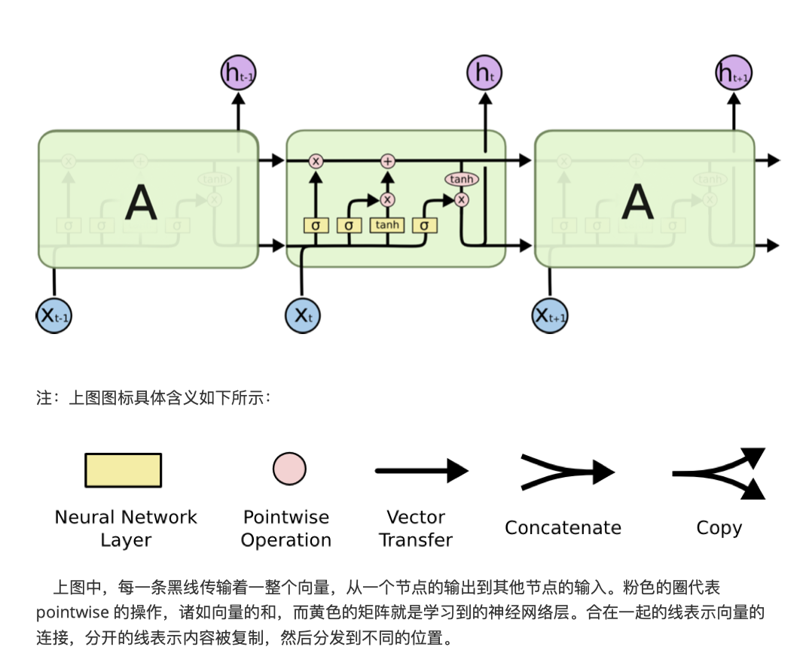
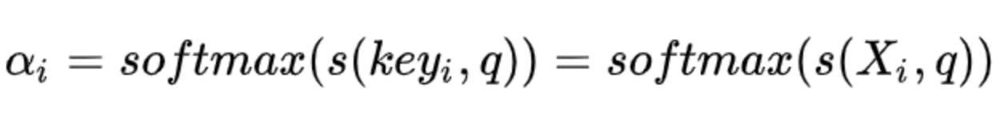

## GRU

当时间步数较大或者时间步较小时，循环神经网络的梯度较容易出现衰减或爆炸。虽然裁剪梯度可以应对梯度爆炸，但无法解决梯度衰减的问题。通常由于这个原因，循环神经网络在实际中较难捕捉时间序列中时间步距离较大的依赖关系。

 门控循环神经网络（gated recurrent neural network）的提出，正是为了更好地捕捉时间序列中时间步距离较大的依赖关系。它通过`可以学习的门来控制信息的流动`。其中，门控循环单元（gated recurrent unit，GRU）是一种常用的门控循环神经网络 [1, 2]。另一种常用的门控循环神经网络则将在下一节中介绍。

### 门控循环单元

下面将介绍门控循环单元的设计。它引入了重置门（reset gate）和更新门（update gate）的概念，从而修改了循环神经网络中隐藏状态的计算方式。


- 门控循环神经网络可以更好地捕捉时间序列中时间步距离较大的依赖关系。
- 门控循环单元引入了门的概念，从而修改了循环神经网络中隐藏状态的计算方式。它包括重置门、更新门、候选隐藏状态和隐藏状态。
- 重置门有助于捕捉时间序列里短期的依赖关系。
- 更新门有助于捕捉时间序列里长期的依赖关系。


## LSTM

LSTM 中引入了3个门，即输入门（input gate）、遗忘门（forget gate）和输出门（output gate），以及与隐藏状态形状相同的记忆细胞（某些文献把记忆细胞当成一种特殊的隐藏状态），从而记录额外的信息。

### 


- 长短期记忆的隐藏层输出包括隐藏状态和记忆细胞。只有隐藏状态会传递到输出层。
- 长短期记忆的输入门、遗忘门和输出门可以控制信息的流动。
- 长短期记忆可以应对循环神经网络中的梯度衰减问题，并更好地捕捉时间序列中时间步距离较大的依赖关系。

## 两种门控模型的区别


## n元语法

> 统计语言模型是计算一个句子的概率的概率模型  **Statistic Language Model**


贝叶斯既条件概率公式 P(A,B) = P(B|A) | P(A) 条件概率的链式法则

**问题** 模型参数太多  


### 神经网络模型

词向量： 对词典D中任意词w，指定一个固定长度的实值向量v(w)既称为w的词向量

- one-hot 
- distributed


## word2vec

但Word2vec模型主要的目的是计算出**『词向量word embedding』**，

### word2vec包含了两个模型

- 跳字模型

- 连续词袋模型

### 近似训练


### 负采样

#### 层序softmax

- 负采样通过考虑同时含有正类样本和负类样本的相互独立事件来构造损失函数。其训练中每一步的梯度计算开销与采样的噪声词的个数线性相关。

- 层序softmax使用了二叉树，并根据根结点到叶结点的路径来构造损失函数。其训练中每一步的梯度计算开销与词典大小的对数相关。


# 注意力机制              

## Attention机制剖析

### 1. 为什么要引入Attention机制

- 计算能力限制
- 优化算法的限制

### 2、 Attention机制有哪些

- `聚焦式foucs注意力`  由上而下 主动注意
- `显著性saliency-based注意力` 由下而上 被动注意

在人工神经网络中，注意力机制一般就特指`聚焦式注意力`

### 3. Attension 机制的计算流程是怎样的


attention 机制的本质就是一个 `addressing` 的过程

**Attention 机制缓解神经网络模型复杂度的体现:**不需要将所有的 N 个输入信息都输入到神经网络进行计算，只需要从 X 中选择一些和任务相关的信息输入给神经网络。

`注意力机制`可以分为三步：

1. 信息输入；

   用 X = [x1, · · · , xN ]表示 N 个输入信息；	

2. 计算注意力分布α；

   令  `key=value=X`  则可以给出注意力分布

   

   αi 称之为`注意力分布（概率分布）`， s(Xi，q) 为`注意力打分机制`，有几种打分方式

   

3. 根据注意力分布α 来计算输入信息的加权平均。，第 i 个信息受关注的程度，采用一种“软性”的信息选择机制对输入信息 X 进行编码为：

   

   这种编码方式为`软性注意力机制（soft Attention）`其选择的信息是所有输入信息在注意力 分布下的期望。  软性注意力机制有两种：普通模式（Key=Value=X）和键值对模式（Key！=Value）。

   

### 4. Attension机制的变种有哪些

- 硬性注意力 只关注到某一个位置上的信息，

  - 一种是选取最高概率的输入信息
  - 另一种硬性注意力口蹄疫通过在注意力分布上随机采样实现
  - 缺点 
    - 硬性注意力的一个缺点是基于最大采样或随机采样的方式来选择信息。因此最终的损失函数与注意力分布之间的函数关系不可导，因此无法使用在反向传播算法进行训练。为了使用反向传播算法，
    - 一般使用软性注意力来代替硬性注意力。硬性注意力需要通过强化学习来进行训练。

- 键值对注意力

  

- 多头注意力

  是利用多个查询 Q = [q1, · · · , qM]，来平行地计算从输入信息中选取多个信息。每个注意力关注输入信息的不同部分，然后再进行拼接：

  

### 5. 一种强大的Attension机制：为什么自注意力在长距离序列中入池强大

#### 1. 卷积或循环神经网络难道不能处理长距离序列吗？

无论卷积还是循环神经网络其实都是对变长序列的一种`“局部编码”`：卷积神经网络显然是基于 N-gram 的局部编码；而对于循环神经网络，由于梯度消失等问题也只能建立短距离依赖。

#### 2. 要解决这种短距离依赖的局部编码问题，从而对输入序列建立长距离依赖关系，有哪些办法呢？

如果要建立输入序列之间的长距离依赖关系，可以使用以下两种方法：

一 种方法是增加网络的层数，通过一个深层网络来获取远距离的信息交互，

另一种方法是使用全连接网络。

#### 3. 自注意力模型具体的计算流程是怎样的呢？


## Transformer（Attension Is All You Need）详解

从 Transformer 这篇论文的题目可以看出，Transformer 的核心就是 Attention，这也就是为什么本文会在剖析玩 Attention 机制之后会引出 Transformer，如果对上面的 Attention 机制特别是自注意力模型（self-Attention model）理解后，Transformer 就很容易理解了。

### 1. transformer的整体架构是怎样的？由那些部分组成


**Transformer 其实这就是一个 Seq2Seq 模型，左边一个 encoder 把输入读进去，右边一个 decoder 得到输出：**

`Transformer=Transformer Encoder+Transformer Decoder`


**sub-layer-1：multi-head self-attention mechanism**，用来进行 self-attention。


**sub-layer-2：Position-wise Feed-forward Networks**，简单的全连接网络，对每个 position 的向量分别进行相同的操作，包括两个线性变换和一个 ReLU 激活输出（输入输出层的维度都为 512，中间层为 2048）：


每个 sub-layer 都使用了残差网络：

**（2）Transformer Decoder（N=6 层，每层包括 3 个 sub-layers）：**


- sub-layer-1：Masked multi-head self-attention mechanism，用来进行 self-attention，与 Encoder 不同：由于是序列生成过程，所以在时刻 i 的时候，大于 i 的时刻都没有结果，只有小于 i 的时刻有结果，因此需要做 Mask。
- sub-layer-2：Position-wise Feed-forward Networks，同 Encoder。
- sub-layer-3：Encoder-Decoder attention 计算。
- 2. transformer encoder 与 transformer decoder 有那些不同

### 3. encoder-deconder attention 与 self-attention you那些不同

1）multi-head self-attention mechanism 不同，Encoder 中不需要使用 Masked，而 Decoder 中需要使用 Masked；

2）Decoder 中多了一层 Encoder-Decoder attention，这与 self-attention mechanism 不同。

它们都是用了 multi-head 计算，不过 Encoder-Decoder attention 采用传统的 attention 机制，其中的 Query 是 self-attention mechanism 已经计算出的上一时间 i 处的编码值，Key 和 Value 都是 Encoder 的输出，这与 self-attention mechanism 不同。代码中具体体现：

```python
 ## Multihead Attention ( self-attention)
            self.dec = multihead_attention(queries=self.dec,
                                           keys=self.dec,
                                           num_units=hp.hidden_units,
                                           num_heads=hp.num_heads,
                                           dropout_rate=hp.dropout_rate,
                                           is_training=is_training,
                                           causality=True,
                                           scope="self_attention")

## Multihead Attention ( Encoder-Decoder attention)
            self.dec = multihead_attention(queries=self.dec,
                                           keys=self.enc,
                                           num_units=hp.hidden_units,
                                           num_heads=hp.num_heads,
                                           dropout_rate=hp.dropout_rate,
                                           is_training=is_training,
                                           causality=False,
                                           scope="vanilla_attention")
```

### 4. muti-head self-attension mechanism 具体的就算过程是怎样的


Transformer 中的 Attention 机制由 Scaled Dot-Product Attention 和 Multi-Head Attention 组成，上图给出了整体流程。下面具体介绍各个环节：


- Expand：实际上是经过线性变换，生成 Q、K、V 三个向量；
- Split heads: 进行分头操作，在原文中将原来每个位置 512 维度分成 8 个 head，每个 head 维度变为 64；
- Self Attention：对每个 head 进行 Self Attention，具体过程和第一部分介绍的一致；
- Concat heads：对进行完 Self Attention 每个 head 进行拼接；


上述过程公式为：


### 5. transformer在GPT和Bert等词向量与训练模型中具体是怎么应用的？有什么变化？

- GPT 中训练的是单向语言模型，其实就是直接应用 Transformer Decoder；

- Bert 中训练的是双向语言模型，应用了 Transformer Encoder 部分，不过在 Encoder 基础上还做了 Masked 操作；

  BERT Transformer 使用双向 self-attention，而 GPT Transformer 使用受限制的 self-attention，其中每个 token 只能处理其左侧的上下文。双向 Transformer 通常被称为“Transformer encoder”，而左侧上下文被称为“Transformer decoder”，decoder 是不能获要预测的信息的。


