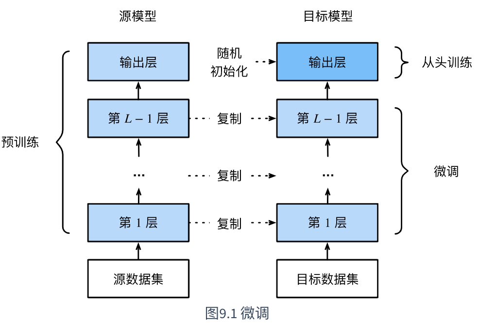
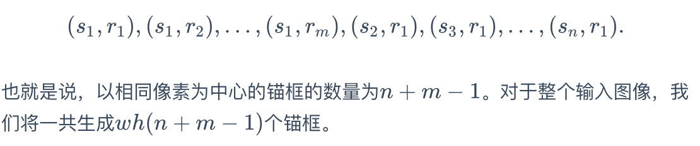
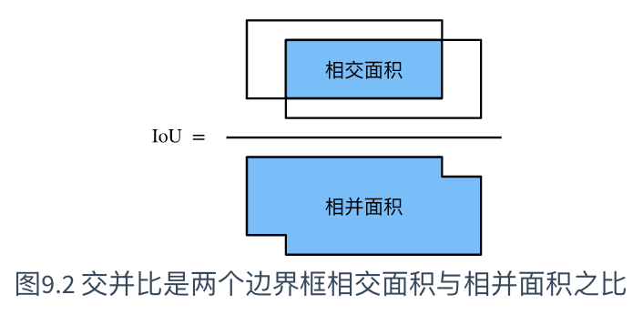
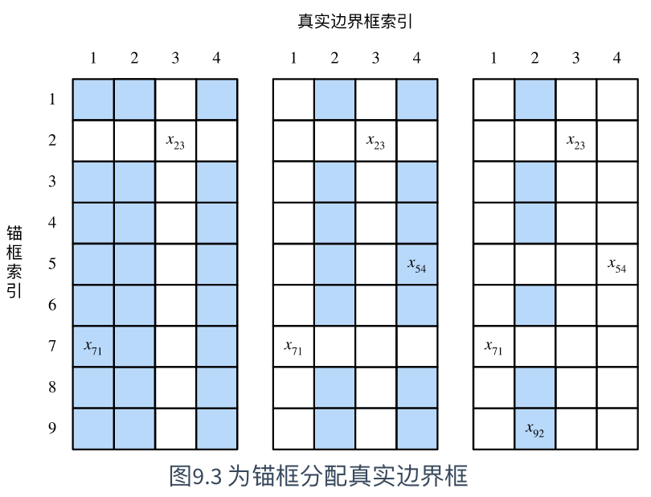

# 计算机视觉

## 1、图像增广

### 定义

图像增广（image augmentation）技术通过对训练图像做一系列随机改变，来产生相似但又不同的训练样本，从而扩大训练数据集的规模。图像增广的另一种解释是，随机改变训练样本可以降低模型对某些属性的依赖，从而提高模型的泛化能力。例如，我们可以对图像进行不同方式的裁剪，使感兴趣的物体出现在不同位置，从而减轻模型对物体出现位置的依赖性。我们也可以调整亮度、色彩等因素来降低模型对色彩的敏感度。

```python
%matplotlib inline
import time
import torch
from torch import nn, optim
from torch.utils.data import Dataset, DataLoader
import torchvision
from PIL import Image

import sys
sys.path.append("..") 
import dl as d2l
device = torch.device('cuda' if torch.cuda.is_available() else 'cpu')
```

### 常见图像增广方法

```python
d2l.set_figsize()
img = Image.open('img/cat1.jpg')
d2l.plt.imshow(img)
```

```python
# 本函数已保存在dl包中方便以后使用
def show_images(imgs, num_rows, num_cols, scale=2):
    figsize = (num_cols * scale, num_rows * scale)
    _, axes = d2l.plt.subplots(num_rows, num_cols, figsize=figsize)
    for i in range(num_rows):
        for j in range(num_cols):
            axes[i][j].imshow(imgs[i * num_cols + j])
            axes[i][j].axes.get_xaxis().set_visible(False)
            axes[i][j].axes.get_yaxis().set_visible(False)
    return axes
```

```python
def apply(img, aug, num_rows=2, num_cols=4, scale=1.5):
    Y = [aug(img) for _ in range(num_rows * num_cols)]
    show_images(Y, num_rows, num_cols, scale)
```

#### 翻转和剪裁

```python
apply(img, torchvision.transforms.RandomHorizontalFlip())
```

```python
apply(img, torchvision.transforms.RandomVerticalFlip())
```

```python
shape_aug = torchvision.transforms.RandomResizedCrop(200, scale=(0.1, 1), ratio=(0.5, 2))
apply(img, shape_aug)
```

#### 变化颜色

亮度brightness 对比度contrast 饱和度saturation

```python
apply(img, torchvision.transforms.ColorJitter(brightness=0.5))
```

```python
apply(img, torchvision.transforms.ColorJitter(hue=0.5))
```

```python
apply(img, torchvision.transforms.ColorJitter(contrast=0.5))
```

```python
color_aug = torchvision.transforms.ColorJitter(
    brightness=0.5, contrast=0.5, saturation=0.5, hue=0.5)
apply(img, color_aug)
```

#### 叠加多个图像增加方法

```python
augs = torchvision.transforms.Compose([
    torchvision.transforms.RandomHorizontalFlip(), color_aug, shape_aug])
apply(img, augs)
```

```python
all_imges = torchvision.datasets.CIFAR10(train=True, root="~/Datasets/CIFAR", download=True)
# all_imges的每一个元素都是(image, label)
show_images([all_imges[i][0] for i in range(32)], 4, 8, scale=0.8);
```

```python
flip_aug = torchvision.transforms.Compose([
     torchvision.transforms.RandomHorizontalFlip(),
     torchvision.transforms.ToTensor()])

no_aug = torchvision.transforms.Compose([
     torchvision.transforms.ToTensor()])
```

```python
num_workers = 0 if sys.platform.startswith('win32') else 4
def load_cifar10(is_train, augs, batch_size, root="~/Datasets/CIFAR"):
    dataset = torchvision.datasets.CIFAR10(root=root, train=is_train, transform=augs, download=True)
    return DataLoader(dataset, batch_size=batch_size, shuffle=is_train, num_workers=num_workers)
```

#### 使用图像增广训练模型

```python
# 本函数已保存在dl包中方便以后使用
def train(train_iter, test_iter, net, loss, optimizer, device, num_epochs):
    net = net.to(device)
    print("training on ", device)
    batch_count = 0
    for epoch in range(num_epochs):
        train_l_sum, train_acc_sum, n, start = 0.0, 0.0, 0, time.time()
        for X, y in train_iter:
            X = X.to(device)
            y = y.to(device)
            y_hat = net(X)
            l = loss(y_hat, y)
            optimizer.zero_grad()
            l.backward()
            optimizer.step()
            train_l_sum += l.cpu().item()
            train_acc_sum += (y_hat.argmax(dim=1) == y).sum().cpu().item()
            n += y.shape[0]
            batch_count += 1
        test_acc = d2l.evaluate_accuracy(test_iter, net)
        print('epoch %d, loss %.4f, train acc %.3f, test acc %.3f, time %.1f sec'
              % (epoch + 1, train_l_sum / batch_count, train_acc_sum / n, test_acc, time.time() - start))
```

```python
def train_with_data_aug(train_augs, test_augs, lr=0.001):
    batch_size, net = 256, d2l.resnet18(10)
    optimizer = torch.optim.Adam(net.parameters(), lr=lr)
    loss = torch.nn.CrossEntropyLoss()
    train_iter = load_cifar10(True, train_augs, batch_size)
    test_iter = load_cifar10(False, test_augs, batch_size)
    train(train_iter, test_iter, net, loss, optimizer, device, num_epochs=10)
```

- 图像增广基于现有训练数据生成随机图像从而应对过拟合。
- 为了在预测时得到确定的结果，通常只将图像增广应用在训练样本上，而不在预测时使用含随机操作的图像增广。
- 可以从torchvision的`transforms`模块中获取有关图片增广的类。

## 2、微调

fine tuning

1. 在源数据集（如ImageNet数据集）上预训练一个神经网络模型，即**源模型**。
2. 创建一个新的神经网络模型，即**目标模型**。它复制了源模型上除了输出层外的所有模型设计及其参数。我们假设这些模型参数包含了**源数据集**上学习到的知识，且这些知识同样适用于**目标数据集**。我们还假设源模型的输出层跟源数据集的标签紧密相关，因此在目标模型中不予采用。
3. 为目标模型添加一个输出大小为目标数据集类别个数的输出层，并随机初始化该层的模型参数。
4. 在目标数据集（如椅子数据集）上训练目标模型。我们将从头训练输出层，而其余层的参数都是基于源模型的参数微调得到的。



当目标数据集远小于元数据集时，微调有助于模型的泛化能力

- 迁移学习将从源数据集学到的知识迁移到目标数据集上。微调是迁移学习的一种常用技术。

- 目标模型复制了源模型上除了输出层外的所有模型设计及其参数，并基于目标数据集微调这些参数。而目标模型的输出层需要从头训练。

- 一般来说，微调参数会使用较小的学习率，而从头训练输出层可以使用较大的学习率。

## 3、目标检测和边界框

然而，很多时候图像里有多个我们感兴趣的目标，我们不仅想知道它们的类别，还想得到它们在图像中的具体位置。在计算机视觉里，我们将这类任务称为目标检测（object detection）或物体检测。

#### 边界框

在目标检测里，我们通常使用边界框（bounding box）来描述目标位置。

## 4、瞄框

目标检测算法通常会在输入图像中采样大量的区域，然后判断这些区域中是否包含我们感兴趣的目标，并调整区域边缘从而更准确地预测目标的真实边界框（ground-truth bounding box）。不同的模型使用的**区域采样方法**可能不同。这里我们介绍其中的一种方法：它以每个像素为中心生成多个大小和宽高比（aspect ratio）不同的边界框。这些边界框被称为锚框（anchor box）。我们将在后面基于锚框实践目标检测。

#### 生成多个瞄框



#### 交并比

我们刚刚提到某个锚框较好地覆盖了图像中的狗。如果该目标的真实边界框已知，这里的“较好”该如何量化呢？一种直观的方法是衡量锚框和真实边界框之间的相似度。



#### 标注训练集的瞄框



#### 输出预测边界框

- 以每个像素为中心，生成多个大小和宽高比不同的锚框。
- 交并比是两个边界框相交面积与相并面积之比。
- 在训练集中，为每个锚框标注两类标签：一是锚框所含目标的类别；二是真实边界框相对锚框的偏移量。
- 预测时，可以使用非极大值抑制来移除相似的预测边界框，从而令结果简洁。

## 5、多尺度目标检测


- 可以在多个尺度下生成不同数量和不同大小的锚框，从而在多个尺度下检测不同大小的目标。

- 特征图的形状能确定任一图像上均匀采样的锚框中心。

- 用输入图像在某个感受野区域内的信息来预测输入图像上与该区域相近的锚框的类别和偏移量。

## 6、目标检测数据集

## 7、单发多框检测SSD

## 8、区域卷积神经网络R-CNN系列

## 9、语义分割和数据集

## 10、全卷积网络 FCN